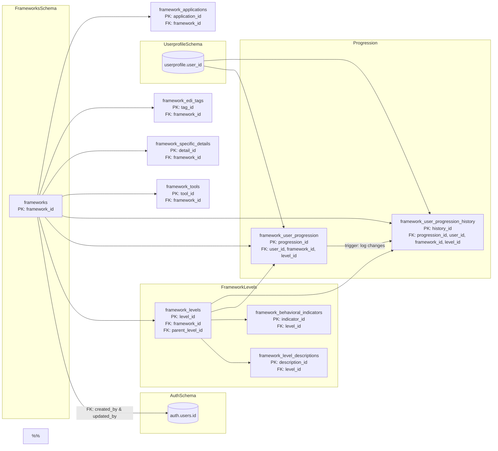
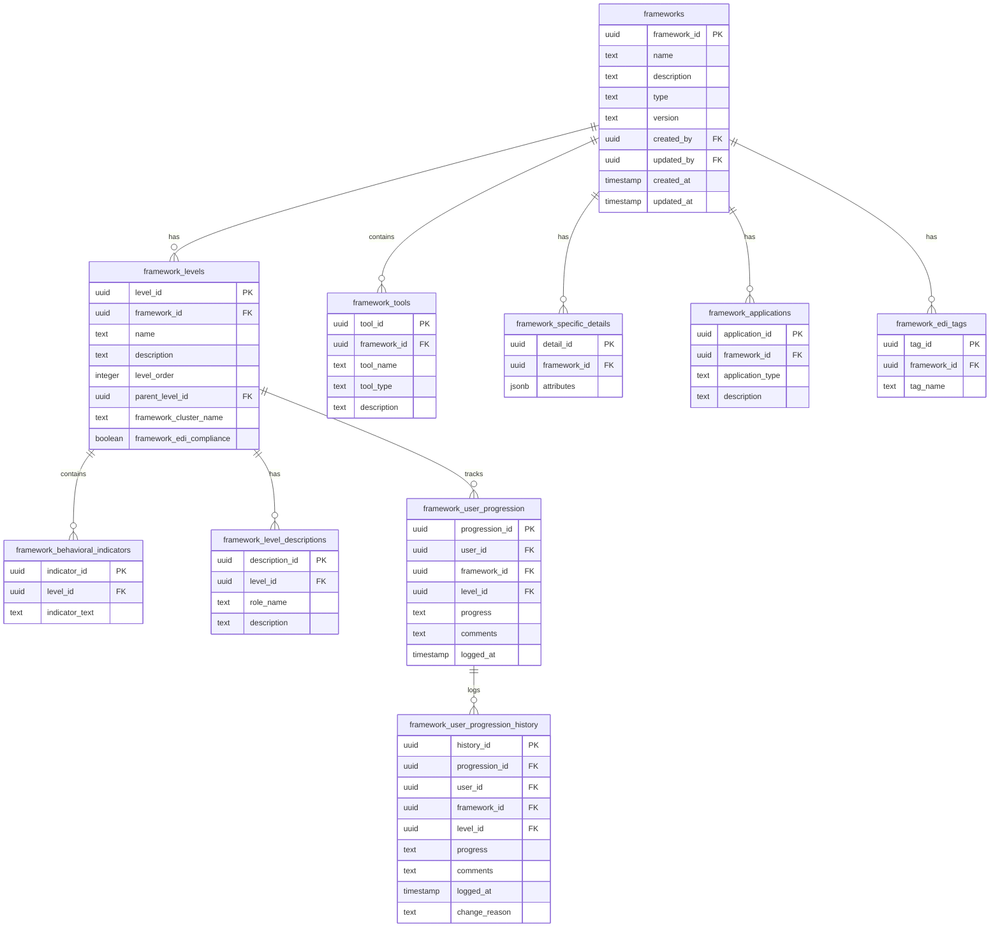

# Pro UI Application Reference Guide

This document serves as a comprehensive reference for the Pro UI application architecture, components, and implementation details. It is maintained by Cascade AI to provide quick access to important information about the application's structure and functionality.

THIS FILE HOLDS NO SENSITIVE DATA OR API KEYS AND IS SAFE TO SHARE.

## Purpose
- Quick reference for application architecture and implementation details
- Centralized documentation for component configurations
- Easy lookup for file locations and component relationships
- Track important implementation decisions and configurations

## Table of Contents
1. [Navigation](#navigation)
2. [Components](#components)
3. [Styling](#styling)
4. [State Management](#state-management)
5. [Utils](#utils)
6. [Stripe Integration](#stripe-integration)
7. [SMART Goals Integration](#smart-goals-integration)
8. [Goals Page Mobile View](#goals-page-mobile-view)
9. [Goal and Milestone Dialogs](#goal-and-milestone-dialogs)
10. [Authentication and Configuration](#authentication-and-configuration)
11. [Database table structure](#database-table-structure)
12. [Email System](#email-system)
13. [Record Backup System](#record-backup-system)
14. [Recent Updates](#recent-updates)
15. [Activity Status Management](#activity-status-management)
16. [URL Handling and Authentication](#url-handling-and-authentication)
17. [Type Safety and Build Error Prevention](#type-safety-and-build-error-prevention)
18. [Goal Type System](#goal-type-system)
19. [Milestone Completion Celebration](#milestone-completion-celebration)
20. [Goal List UI System](#goal-list-ui-system)
21. [Supabase Functions](#supabase-functions)

---

[Previous sections remain unchanged...]

## Email System

### Overview
The email system provides a modular, type-safe implementation using NodeMailer. Located in `/lib/email/`, it supports HTML emails, attachments, templating, queuing, and mass email capabilities.

### Directory Structure
```
lib/email/
├── email-service.ts     # Core email functionality
├── constants.ts         # Configuration constants
├── types.ts            # Type definitions
├── email-templates/    # Email template system
│   ├── base-template.ts  # Base template structure
│   ├── index.ts         # Template exports
│   └── templates/       # Individual templates
│       ├── welcome.ts   # Welcome email template
│       └── notification.ts # Notification email template
├── queue/             # Queue management
│   ├── index.ts        # Queue exports
│   └── queue-service.ts # Queue implementation
├── attachments/       # Attachment handling
│   ├── index.ts        # Attachment exports
│   └── handlers.ts     # Attachment processors
└── validation/        # Email validation
    ├── index.ts        # Validation exports
    └── validators.ts   # Validation rules
```

### Email Scheduler System

#### Directory Structure
```
lib/email/
├── scheduler/
│   └── scheduler-service.ts   # Email scheduling functionality
├── utils/
│   └── timezone-utils.ts      # Timezone handling utilities
├── types.ts                   # Types including scheduler interfaces
└── constants.ts               # Constants including scheduler config
```

#### Webhook Endpoint
- Route: `/api/email-scheduler`
- Method: POST
- Authentication: API Key (x-api-key header)
- Purpose: Processes scheduled emails that are due to be sent
- Response Format: JSON with processing details and statistics

#### Latest Implementation Details (as of 2025-01-08)
1. Timezone Handling:
   - Proper handling of seconds in time format
   - Comprehensive timezone validation and conversion
   - UTC-based time comparisons for accuracy
   - Detailed logging of timezone conversions

2. Email Processing:
   - Batch processing with configurable batch size
   - Detailed status tracking (pending/in_progress/sent/failed)
   - Processing time measurement per email
   - Comprehensive error handling and logging

3. Success Metrics:
   - Successfully processes multiple emails in parallel
   - Average processing time: 2.5-3 seconds per email
   - Reliable delivery with proper status updates
   - Zero timezone-related processing errors

4. Monitoring and Logging:
   - Detailed debug logging throughout the workflow
   - Time comparison logging with timestamps
   - Email preparation and sending status logs
   - Error tracking with stack traces

#### Configuration
Environment variables for scheduler:
```env
EMAIL_SCHEDULER_MAX_RETRIES=3
EMAIL_SCHEDULER_RETRY_DELAY=300000
EMAIL_SCHEDULER_BATCH_SIZE=50
EMAIL_SCHEDULER_TIMEZONE_DEFAULT=UTC
EMAIL_SCHEDULER_API_KEY=your-secure-api-key
```

### Configuration
Environment variables required for email functionality:
```env
# SMTP Configuration
SMTP_SERVER_HOST=smtp.gmail.com
SMTP_SERVER_PORT=587
SMTP_SERVER_USERNAME=sim2kuk@gmail.com
SMTP_SERVER_PASSWORD=ybskihbhjykajcyn
SMTP_SECURE=true

# Email Addresses
EMAIL_FROM=coachAjay@Veedence.co.uk
EMAIL_REPLY_TO=NoReply@Veedence.co.uk
EMAIL_BCC=

# Email Limits
EMAIL_RATE_LIMIT=100
EMAIL_BATCH_SIZE=50
EMAIL_RETRY_ATTEMPTS=3
EMAIL_QUEUE_TIMEOUT=300

# Attachment Settings
MAX_ATTACHMENT_SIZE=10485760
ALLOWED_ATTACHMENT_TYPES=pdf,doc,docx,txt,jpg,jpeg,png

# Monitoring
EMAIL_LOGGING_ENABLED=true
EMAIL_MONITORING_WEBHOOK=
```

### Core Features

#### 1. Email Service (`email-service.ts`)
Main functions:
- `sendEmail`: Send a single email
- `queueEmail`: Queue an email for later sending
- `sendBulkEmails`: Send multiple emails
- `getEmailQueueStatus`: Get queue statistics
- `getEmailStatus`: Get status of a specific email

Implementation details:
- Automatic retry mechanism
- Rate limiting
- Error handling
- Logging and monitoring
- Type safety throughout

#### 2. Email Templates
Base template features:
- Responsive design
- Dynamic variable interpolation
- HTML and plain text versions
- Customizable sections:
  - Header with logo
  - Content area
  - Footer with copyright

Available templates:
1. Welcome Email
   - Personalized greeting
   - Onboarding steps
   - Support information

2. Notification Email
   - Customizable title
   - Optional CTA button
   - Dynamic content areas

#### 3. Queue Management
Features:
- Priority levels (high, normal, low)
- Rate limiting
- Batch processing
- Retry mechanism with exponential backoff
- Scheduled sending
- Queue monitoring
- Failed email handling

#### 4. Attachment Handling
Capabilities:
- File size validation (max 10MB)
- File type verification
- Content type detection
- Stream processing
- Multiple attachment support
- Supported formats:
  - Documents: PDF, DOC, DOCX, TXT
  - Images: JPG, JPEG, PNG

#### 5. Validation System
Validation types:
- Email syntax validation
- Domain validation
- Attachment validation
- Content validation
- Rate limit checking
- Queue status validation

### Usage Examples

1. Basic Email:
```typescript
import { sendEmail } from '@/lib/email/email-service';

await sendEmail({
  to: 'recipient@example.com',
  subject: 'Test Email',
  text: 'This is a test email',
  html: '<p>This is a test email</p>'
});
```

2. Template Email:
```typescript
import { createWelcomeEmail } from '@/lib/email/email-templates';
import { sendEmail } from '@/lib/email/email-service';

const emailContent = createWelcomeEmail({ name: 'John Doe' });
await sendEmail({
  to: 'john@example.com',
  ...emailContent
});
```

3. Queued Email:
```typescript
import { queueEmail } from '@/lib/email/email-service';

const { queueId } = await queueEmail({
  to: 'recipient@example.com',
  subject: 'Scheduled Email',
  text: 'This email will be sent later'
}, {
  priority: 'high',
  scheduled: new Date('2025-01-08T00:00:00Z')
});
```

4. Email with Attachment:
```typescript
import { sendEmail } from '@/lib/email/email-service';
import { processFileAttachment } from '@/lib/email/attachments';

const attachment = await processFileAttachment('/path/to/file.pdf');
if (attachment) {
  await sendEmail({
    to: 'recipient@example.com',
    subject: 'Email with Attachment',
    text: 'Please find the attachment',
    attachments: [attachment]
  });
}
```

### Error Handling
Comprehensive error handling for:
- SMTP connection errors
- Email validation errors
- Attachment processing errors
- Queue processing errors
- Rate limit exceeded errors
- Template processing errors

### Monitoring
Available monitoring:
- Success/failure logging
- Queue status tracking
- Rate limit monitoring
- Error tracking
- Optional webhook notifications
- Performance metrics

### Best Practices
1. Always use email templates for consistency
2. Implement proper error handling
3. Use queue for bulk emails
4. Monitor rate limits
5. Validate email addresses and attachments
6. Use environment variables for configuration
7. Keep HTML emails responsive
8. Provide plain text alternatives
9. Handle attachments securely
10. Implement retry logic for failures

## Recent Email System Updates

#### Type System Improvements
1. Template System
   - Enhanced type safety in notification templates
   - Safe variable transformation using `toTemplateVariables`
   - Strict typing for template variables
   - Clear separation between notification and template variables

2. Attachment Handling
   - Switched from stream to buffer-based processing
   - Type-safe attachment interface
   - Required size property for all attachments
   - Improved error handling and validation

3. Queue Management
   - Cross-version compatible iteration in queue processing
   - Array-based batch processing
   - Type-safe priority handling
   - Improved queue item processing

4. Auth Integration
   - Automatic userprofile email updates
   - Synchronized email changes across auth and profile systems
   - Error logging for profile updates
   - Maintains data consistency

## Stripe Integration

### Overview
The application implements a complete Stripe payment system with test and live environments, webhook handling, and database integration. The implementation supports multiple currencies and two payment types: "Worth" and "Afford".

### Directory Structure
```
/app/api/stripe/
├── create-session/
│   └── route.ts       # Handles checkout session creation
├── session-status/
│   └── route.ts       # Verifies payment status
└── webhook/
    └── route.ts       # Processes Stripe webhooks
/lib/stripe/
└── client.ts          # Client-side Stripe functions
/components/settings/billing-section/
└── payment-form.tsx   # Payment UI component
```

### Database Schema
```sql
CREATE TABLE public.payments (
    paymentid uuid NOT NULL DEFAULT gen_random_uuid(),
    user_id uuid NOT NULL,
    issuccess boolean NOT NULL,
    status text NOT NULL,
    paymentstatus text NOT NULL,
    paymentintentstatus text NOT NULL,
    customeremail text NOT NULL,
    amount numeric NOT NULL,
    currency text NOT NULL,
    paymenttype text NOT NULL,
    timepaid timestamp without time zone NULL DEFAULT (now() AT TIME ZONE 'utc'::text),
    stripepaymentid text NULL,
    CONSTRAINT payments_pkey PRIMARY KEY (paymentid),
    CONSTRAINT payments_user_id_fkey FOREIGN KEY (user_id) REFERENCES userprofile(user_id) ON DELETE CASCADE
);
```

### API Implementation Details

#### 1. Create Session Endpoint
```typescript
// /app/api/stripe/create-session/route.ts
export async function POST(request: Request) {
  // Request body structure
  interface CreateSessionRequest {
    currency: string;
    amount: number;
    paymentType: 'afford' | 'worth';
  }

  // Session creation configuration
  const session = await stripe.checkout.sessions.create({
    payment_method_types: ['card'],
    mode: 'payment',
    submit_type: 'pay',
    billing_address_collection: 'auto',
    metadata: {
      paymentType,
      originalAmount: amount.toString(),
      currency,
      user_id: request.headers.get('x-user-id') || ''
    },
    line_items: [{
      price_data: {
        currency: currency.toLowerCase(),
        product_data: {
          name: 'AI Coaching Subscription',
          description: `${paymentType === 'worth' ? 'Value-based' : 'Accessibility-based'} payment`,
        },
        unit_amount: Math.round(amount * 100),
      },
      quantity: 1,
    }],
    success_url: `${origin}/settings?tab=billing&session_id={CHECKOUT_SESSION_ID}&status=success`,
    cancel_url: `${origin}/settings?tab=billing&status=cancelled`,
  });
}
```

### Environment Detection
```typescript
// /lib/config/environment.ts
const isTestEnvironment = (hostname: string): boolean => {
  return hostname === 'sim2k.sytes.net' || 
         hostname.includes('localhost') || 
         hostname.includes('127.0.0.1');
};

const isLiveEnvironment = (hostname: string): boolean => {
  return hostname === 'coach.veedence.com';
};
```

### Webhook Configuration
1. **Test Environment**
   - URL: http://sim2k.sytes.net/api/stripe/webhook
   - Events: checkout.session.completed
   - API Version: 2024-12-18.acacia

2. **Production Environment**
   - URL: https://coach.veedence.com/api/stripe/webhook
   - Events: checkout.session.completed
   - API Version: 2024-12-18.acacia

### Type Definitions
```typescript
// /types/stripe.ts
export type StripeCurrency = 'USD' | 'GBP' | 'EUR' | 'CAD' | 'AUD';

export interface CreateSessionRequest {
  currency: string;
  amount: number;
  paymentType: 'afford' | 'worth';
}

export interface CheckoutSession {
  id: string;
  url: string;
}

export type StripeSessionResponse = {
  isSuccess: boolean;
  status: 'complete' | 'expired' | 'open';
  paymentStatus: 'paid' | 'unpaid' | 'no_payment_required';
  paymentIntentStatus: 'succeeded' | 'processing' | 'requires_payment_method' | 'requires_confirmation' | 'requires_action' | 'canceled';
  customerEmail: string;
  amount: number;
  currency: string;
  paymentType: string;
  timePaid: Date | null;
  stripePaymentId: string | null;
};
```

## SMART Goals Integration

### Database Schema
```sql
create table smartgoals (
  smart_id uuid default uuid_generate_v4() primary key,
  goal_id uuid references goals(goal_id) on delete cascade,
  user_id uuid references auth.users(id) on delete cascade,
  specific text,
  measurable text,
  achievable text,
  relevant text,
  time_bound date,
  smart_progress integer default 0,
  status text default 'Pending',
  created_at timestamp with time zone default timezone('utc'::text, now()),
  updated_at timestamp with time zone default timezone('utc'::text, now()),
  review_needed boolean default false,
  review_previous_smart jsonb
);

-- Indexes
create index idx_smartgoals_goal_id on smartgoals(goal_id);
create index idx_smartgoals_user_id on smartgoals(user_id);
```

### Component Structure

#### 1. SmartGoalDialog (`components/goals/smart-goal-dialog.tsx`)
- **Purpose**: Create and edit SMART goal details
- **State Management**:
  ```typescript
  interface SmartGoal {
    smart_id: string;
    specific: string | null;
    measurable: string | null;
    achievable: string | null;
    relevant: string | null;
    time_bound: string | null;
    smart_progress: number;
    status: 'Pending' | 'In Progress' | 'Completed' | 'On Hold';
  }

  interface SmartGoalDialogProps {
    open: boolean;
    onOpenChange: (open: boolean) => void;
    goalId: string;
    smartGoal: SmartGoal | null;
    onSmartGoalChange: () => void;
    previousSmartGoalData?: Partial<SmartGoal> | null;
  }
  ```

- **Layout**:
  - Max width: 600px
  - Two-column grid on desktop
  - Single column on mobile
  - Responsive padding: p-6
  - Form spacing: space-y-8
  - Grid gap: gap-8

- **Form Fields**:
  1. Specific:
     - Textarea component
     - Min height: 120px
     - Resizable vertically
     - Required field
     - 5 rows default
  2. Measurable:
     - Textarea component
     - Min height: 120px
     - Resizable vertically
     - Required field
     - 5 rows default
  3. Achievable:
     - Textarea component
     - Min height: 120px
     - Resizable vertically
     - Required field
     - 5 rows default
  4. Relevant:
     - Textarea component
     - Min height: 120px
     - Resizable vertically
     - Required field
     - 5 rows default
  5. Time-bound:
     - Date input
     - Height: 40px (h-10)
     - Required field
  6. Progress:
     - Slider component
     - Range: 0-100
     - Step: 1
  7. Status:
     - Select component
     - Options: Pending, In Progress, Completed, On Hold
     - Height: 40px (h-10)

#### 2. SmartGoalDetails (`components/goals/smart-goal-details.tsx`)
- **Purpose**: Display SMART goal details in an expanded view
- **Layout Structure**:
  1. Header Section:
     - Title: "SMART Details"
     - Status badge
     - Edit/Add button
     - Border bottom separator

  2. Progress Section:
     - Progress percentage
     - Progress bar (h-2)
     - Border bottom separator

  3. SMART Criteria Sections:
     - Divide-y separation
     - Each section:
       ```typescript
       {
         indicator: "h-8 w-1 rounded-full",
         title: "font-medium text-{color}-900",
         content: "pl-4 ml-3 border-l-2 border-{color}-100"
       }
       ```
     - Color scheme:
       - Specific: purple-600
       - Measurable: blue-600
       - Achievable: green-600
       - Relevant: yellow-600
       - Time-bound: red-600

## API and Database Integration

### Coach_CustomGPT_Connect_Details.yml Structure

The `Coach_CustomGPT_Connect_Details.yml` file defines the OpenAPI 3.1.0 specification for the application's API endpoints. This file follows a specific pattern that aligns with the database structure:

#### Pattern Structure
1. **API Endpoints Pattern**
   - Each endpoint follows the pattern `/rest/v1/rpc/ac_tbl_[table_name]_functions`
   - Endpoints correspond directly to database tables
   - Functions follow CRUD operations (insert, update, delete)

2. **Database Integration**
   - Each API endpoint maps to specific database tables
   - Table names in the database match the endpoint names (e.g., `emailtosend` table maps to email-related endpoints)
   - Database constraints (like status checks) are reflected in API request/response schemas

3. **Common Patterns**
   - All tables include:
     - UUID primary keys
     - user_id foreign key reference
     - created_at and updated_at timestamps
     - status tracking fields
   - All endpoints include:
     - Authentication requirements
     - Error handling
     - Consistent response formats

4. **Security Patterns**
   - x-openai-isConsequential flags for sensitive operations
   - Consistent authentication across endpoints
   - Input validation matching database constraints

This structure ensures tight integration between the API specification and database schema, maintaining consistency across the application's data layer.

## Goals Page Mobile View

### Layout Hierarchy
1. **Navigation Menu**
   - Fixed at top of screen
   - z-index: highest (above all content)
   - Height: 4rem (64px)

2. **Back Button**
   - Visible only on mobile (`block md:hidden`)
   - Sticky positioned below menu (`top-16`)
   - z-index: 40 (below menu, above content)
   - Background: white
   - Border bottom for visual separation
   - Padding: pt-4 pb-2 px-4
   - Negative margins (-mt-4 -mx-4) to align with parent padding
   - Only shows in goal details view

3. **Goal Title**
   - Positioned below back button
   - Top margin: mt-4 (mobile only)
   - Font: text-2xl, bold
   - Color: text-gray-900

### View States and Transitions
1. **Goals List View (Mobile)**
   - Full width when visible (`w-full`)
   - Hidden when showing details (`showDetailsOnMobile ? 'hidden md:block' : 'block'`)
   - Contains list of goals with click handlers

2. **Goal Details View (Mobile)**
   - Full width when visible (`w-full`)
   - Shows when goal selected (`showDetailsOnMobile` true)
   - Transition triggered by `onSelectGoal` in GoalsList
   - Back button triggers `setShowDetailsOnMobile(false)`

### Component Structure
1. **GoalsPage Component**
   - Manages view state with `showDetailsOnMobile`
   - Controls visibility of list vs details
   - Maintains maximized state for desktop

2. **GoalDetails Component**
   - Handles back navigation
   - Contains sticky back button
   - Manages edit/delete actions
   - Responsive layout with mobile-first design

### Mobile-Specific Classes
```css
/* Back Button Container */
.sticky.top-16.left-0.z-40.bg-white.-mt-4.-mx-4.px-4.pt-4.pb-2.block.md:hidden.border-b

/* Goals List Mobile */
.w-full.md:w-1/3.border-r.border-gray-200.bg-white.p-4.md:p-6

/* Goal Details Mobile */
.w-full.p-4.md:p-6.bg-white
```

### State Management
1. **View Transitions**
   ```typescript
   // Show details view
   onSelectGoal={(goal) => {
     setSelectedGoal(goal);
     setShowDetailsOnMobile(true);
   }}
   
   // Return to list view
   onBack={() => setShowDetailsOnMobile(false)}
   ```

2. **Visibility Control**
   ```typescript
   // List visibility
   `${showDetailsOnMobile ? 'hidden md:block' : 'block'}`
   
   // Details visibility
   `${!showDetailsOnMobile ? 'hidden' : 'block'} md:block`
   ```

### Responsive Breakpoints
- Mobile: Default styles
- Desktop: md: prefix (768px and above)
- Transitions between views only occur on mobile
- Desktop shows both views side by side

### Important Implementation Details
1. Back button must remain below fixed navigation
2. Content scrolls independently under sticky elements
3. Proper z-index layering ensures menu > back button > content
4. Negative margins on back button container align with parent padding
5. Mobile transitions maintain scroll position
6. Desktop view remains unaffected by mobile view states

## Record Backup System

### Goals and Milestones Backup
1. Record Backup Conditions:
   - Backup is only stored when `review_needed` is `false`
   - When a backup is stored, `review_needed` is set to `true`
   - Previous record data is stored in JSON format
   - Goals use `review_previous_goal` field for backup
   - Milestones use `review_previous_milestone` field for backup

2. Goal Backup Fields:
   ```typescript
   {
     goal_description: string;
     goal_type: string;
     target_date: string;
     progress: number;
     effort_level: number;
     is_completed: boolean;
     goal_title: string;
   }
   ```

3. Milestone Backup Fields:
   ```typescript
   {
     milestone_description: string;
     target_date: string;
     achieved: boolean;
     achievement_date: string | null;
   }
   ```

4. Backup Process:
   - Current state is captured before editing starts
   - Backup is stored only if the record is not under review
   - When backup is stored, record is marked for review
   - Backup is stored as a partial type of the original record

5. Review Notifications:
   - Toast notification appears in two scenarios:
     1. When an existing record update is flagged for review
     2. When a new goal or milestone is created
   - Notification duration: 10 seconds
   - Messages:
     - For updates: "This [goal/milestone] update has been flagged for review with Ajay in your next AI session."
     - For new records: "This new [goal/milestone] has been flagged for review with Ajay in your next AI session."
   - Descriptions:
     - For updates: "Changes will be discussed and reviewed during the session."
     - For new records: "The [goal/milestone] will be discussed and reviewed during the session."
   - All new goals and milestones are automatically set with `review_needed: true`
   - For existing records, only shown when `review_needed` changes from `false` to `true`

## Recent Updates (2024-12-31)

### Profile Page Updates

#### Account Status Section
- Renamed from "Account Settings" to "Account Status"
- Displays subscription and account status information
- All status indicators are read-only (no user modification allowed)

Components:
1. **Subscription End Date**
   - Shows user's subscription expiry date
   - Red background if subscription has expired
   - Date displayed in user's local format

2. **Active Status**
   - Shows "Active Status: Active" or "Active Status: Inactive"
   - Red background when inactive
   - Read-only status display
   - Removed user toggle switch
   - Status tied to subscription validity

3. **Induction Status**
   - Shows "Induction: Complete" or "Induction: Incomplete"
   - Read-only status display
   - Removed user toggle switch

4. **Last Login**
   - Updated to "Last Login with Ajay"
   - Shows timestamp in user's local format

### Activity Status Management

#### Client-Side Updates
- Immediate status updates after successful payment
- No page refresh required for status changes
- Periodic status checks (30-second intervals)
- Window focus triggers status refresh

#### Implementation Details
- Uses localStorage for persistent state
- Global isUserActive state for real-time updates
- Webhook updates database on payment success
- ActivityInitializer component manages status checks
- ActivityGuard enforces access based on status

## Activity Status Management

#### Client-Side Updates
- Immediate status updates after successful payment
- No page refresh required for status changes
- Periodic status checks (30-second intervals)
- Window focus triggers status refresh

#### Implementation Details
- Uses localStorage for persistent state
- Global isUserActive state for real-time updates
- Webhook updates database on payment success
- ActivityInitializer component manages status checks
- ActivityGuard enforces access based on status

## Database Table Structure

### User Profile Table (`userprofile`)
```sql
create table public.userprofile (
    user_id uuid not null,
    first_name text null,
    last_name text null,
    email text null,
    phone text null,
    created_at timestamp with time zone default timezone('utc'::text, now()) not null,
    updated_at timestamp with time zone default timezone('utc'::text, now()) not null,
    is_active boolean default false not null,
    induction_complete boolean default false not null,
    last_login timestamp with time zone null,
    subscription_end_date timestamp with time zone null,
    constraint userprofile_pkey primary key (user_id),
    constraint userprofile_user_id_fkey foreign key (user_id) references auth.users(id) on delete cascade
);
```

### Framework Tables
```sql

create table
  public.frameworks (
    framework_id uuid not null default gen_random_uuid (),
    name text not null,
    description text null,
    type text not null,
    version text null default '1.0'::text,
    created_by uuid null,
    updated_by uuid null,
    created_at timestamp with time zone null default now(),
    updated_at timestamp with time zone null default now(),
    constraint frameworks_pkey primary key (framework_id),
    constraint frameworks_created_by_fkey foreign key (created_by) references auth.users (id),
    constraint frameworks_updated_by_fkey foreign key (updated_by) references auth.users (id)
  ) tablespace pg_default;

create index if not exists idx_framework_name on public.frameworks using btree (name) tablespace pg_default;

create table
  public.framework_user_progression_history (
    history_id uuid not null default gen_random_uuid (),
    progression_id uuid not null,
    user_id uuid not null,
    framework_id uuid not null,
    level_id uuid not null,
    progress text null,
    comments text null,
    logged_at timestamp with time zone null default now(),
    change_reason text null,
    constraint framework_user_progression_history_pkey primary key (history_id),
    constraint framework_user_progression_history_framework_id_fkey foreign key (framework_id) references frameworks (framework_id) on delete cascade,
    constraint framework_user_progression_history_level_id_fkey foreign key (level_id) references framework_levels (level_id) on delete cascade,
    constraint framework_user_progression_history_progression_id_fkey foreign key (progression_id) references framework_user_progression (progression_id) on delete cascade,
    constraint framework_user_progression_history_user_id_fkey foreign key (user_id) references userprofile (user_id) on delete cascade
  ) tablespace pg_default;

  create table
  public.framework_user_progression (
    progression_id uuid not null default gen_random_uuid (),
    user_id uuid not null,
    framework_id uuid not null,
    level_id uuid not null,
    progress text null,
    comments text null,
    logged_at timestamp with time zone null default now(),
    constraint framework_user_progression_pkey primary key (progression_id),
    constraint framework_user_progression_framework_id_fkey foreign key (framework_id) references frameworks (framework_id) on delete cascade,
    constraint framework_user_progression_level_id_fkey foreign key (level_id) references framework_levels (level_id) on delete cascade,
    constraint framework_user_progression_user_id_fkey foreign key (user_id) references userprofile (user_id) on delete cascade
  ) tablespace pg_default;

create index if not exists idx_framework_user_progression_user_id on public.framework_user_progression using btree (user_id) tablespace pg_default;

create index if not exists idx_framework_user_progression_framework_id on public.framework_user_progression using btree (framework_id) tablespace pg_default;

create index if not exists idx_framework_user_progression_level_id on public.framework_user_progression using btree (level_id) tablespace pg_default;

create trigger framework_user_progression_trigger
after delete
or
update on framework_user_progression for each row
execute function log_framework_user_progression_changes ();

create table
  public.framework_tools (
    tool_id uuid not null default gen_random_uuid (),
    framework_id uuid not null,
    tool_name text not null,
    tool_type text not null,
    description text not null,
    constraint framework_tools_pkey primary key (tool_id),
    constraint framework_tools_framework_id_fkey foreign key (framework_id) references frameworks (framework_id) on delete cascade
  ) tablespace pg_default;

create index if not exists idx_framework_tool_name on public.framework_tools using btree (tool_name) tablespace pg_default;

create table
  public.framework_specific_details (
    detail_id uuid not null default gen_random_uuid (),
    framework_id uuid not null,
    attributes jsonb not null,
    constraint framework_specific_details_pkey primary key (detail_id),
    constraint framework_specific_details_framework_id_fkey foreign key (framework_id) references frameworks (framework_id) on delete cascade
  ) tablespace pg_default;


create table
  public.framework_levels (
    level_id uuid not null default gen_random_uuid (),
    framework_id uuid not null,
    name text not null,
    description text null,
    level_order integer not null,
    parent_level_id uuid null,
    framework_cluster_name text null,
    framework_edi_compliance boolean null default false,
    constraint framework_levels_pkey primary key (level_id),
    constraint framework_levels_framework_id_fkey foreign key (framework_id) references frameworks (framework_id) on delete cascade,
    constraint framework_levels_parent_level_id_fkey foreign key (parent_level_id) references framework_levels (level_id) on delete cascade
  ) tablespace pg_default;

create index if not exists idx_framework_level_name on public.framework_levels using btree (name) tablespace pg_default;

create index if not exists idx_framework_cluster_name on public.framework_levels using btree (framework_cluster_name) tablespace pg_default;

create table
  public.framework_level_descriptions (
    description_id uuid not null default gen_random_uuid (),
    level_id uuid not null,
    role_name text not null,
    description text not null,
    constraint framework_level_descriptions_pkey primary key (description_id),
    constraint framework_level_descriptions_level_id_fkey foreign key (level_id) references framework_levels (level_id) on delete cascade
  ) tablespace pg_default;

  create table
  public.framework_edi_tags (
    tag_id uuid not null default gen_random_uuid (),
    framework_id uuid not null,
    tag_name text not null,
    constraint framework_edi_tags_pkey primary key (tag_id),
    constraint framework_edi_tags_framework_id_fkey foreign key (framework_id) references frameworks (framework_id) on delete cascade
  ) tablespace pg_default;

  create table
  public.framework_behavioral_indicators (
    indicator_id uuid not null default gen_random_uuid (),
    level_id uuid not null,
    indicator_text text not null,
    constraint framework_behavioral_indicators_pkey primary key (indicator_id),
    constraint framework_behavioral_indicators_level_id_fkey foreign key (level_id) references framework_levels (level_id) on delete cascade
  ) tablespace pg_default;

  create table
  public.framework_applications (
    application_id uuid not null default gen_random_uuid (),
    framework_id uuid not null,
    application_type text not null,
    description text not null,
    constraint framework_applications_pkey primary key (application_id),
    constraint framework_applications_framework_id_fkey foreign key (framework_id) references frameworks (framework_id) on delete cascade
  ) tablespace pg_default;

create index if not exists idx_framework_application_type on public.framework_applications using btree (application_type) tablespace pg_default;

```

### Framework Tables Relationship Diagram





### User Logins Table (`userlogins`)
```sql
create table public.userlogins (
    login_id uuid not null default gen_random_uuid(),
    user_id uuid not null,
    login_time timestamp with time zone default timezone('utc'::text, now()) not null,
    ip_address text null,
    user_agent text null,
    device_info text null,
    constraint userlogins_pkey primary key (login_id),
    constraint userlogins_user_id_fkey foreign key (user_id) references auth.users(id) on delete cascade
);
```

### Milestones Table (`milestones`)
```sql
create table public.milestones (
    milestone_id uuid not null default gen_random_uuid(),
    goal_id uuid null,
    milestone_description text not null,
    target_date date not null,
    achieved boolean default false not null,
    achievement_date date null,
    created_at timestamp with time zone default timezone('utc'::text, now()) not null,
    updated_at timestamp with time zone default timezone('utc'::text, now()) not null,
    review_needed boolean default true not null,
    review_previous_milestone jsonb null,
    constraint milestones_pkey primary key (milestone_id),
    constraint milestones_goal_id_fkey foreign key (goal_id) references goals(goal_id) on delete cascade
);
```

### Engagement Table (`engagement`)
```sql
create table public.engagement (
    engagement_id uuid not null default gen_random_uuid(),
    user_id uuid null,
    interaction_type character varying(50) null,
    interaction_details jsonb null,
    created_at timestamp with time zone default timezone('utc'::text, now()) not null,
    updated_at timestamp with time zone default timezone('utc'::text, now()) not null,
    constraint engagement_pkey primary key (engagement_id),
    constraint engagement_user_id_fkey foreign key (user_id) references auth.users(id) on delete cascade
);
```

### emails to send Table (`emailtosend`)
```sql
create table
  public.emailtosend (
    email_id uuid not null default gen_random_uuid (),
    user_id uuid not null,
    to_email text not null,
    cc_email text null,
    bcc_email text null,
    subject text not null,
    body text not null,
    attachment_url text null,
    date_to_send date not null,
    time_to_send time without time zone not null,
    timezone text null default 'UTC'::text,
    sent boolean null default false,
    retry_count integer null default 0,
    status text null default 'scheduled'::text,
    priority smallint null default 2,
    template_id uuid null,
    created_at timestamp without time zone null default now(),
    updated_at timestamp without time zone null default now(),
    constraint emailtosend_pkey primary key (email_id),
    constraint fk_user foreign key (user_id) references userprofile (user_id) on delete cascade,
    constraint emailtosend_priority_check check ((priority = any (array[1, 2, 3]))),
    constraint emailtosend_status_check check (
      (
        status = any (
          array[
            'scheduled'::text,
            'in_progress'::text,
            'sent'::text,
            'failed'::text
          ]
        )
      )
    )
  ) tablespace pg_default;

create trigger set_updated_at before
update on emailtosend for each row
execute function update_updated_at_column ();
```

### Database Indexes
```sql
create index if not exists users_instance_id_email_idx 
on auth.users using btree (instance_id, lower((email)::text)) 
tablespace pg_default;

create unique index if not exists confirmation_token_idx 
on auth.users using btree (confirmation_token) 
tablespace pg_default
where ((confirmation_token)::text !~ '^[0-9 ]*$'::text);
```

## URL Handling and Authentication

### URL Handling
   - Utility: `url-utils.ts`
   - Functions:
     - `getBaseUrl()` - Dynamic base URL detection
       - Browser: Uses `window.location.origin` (automatically gets current domain)
       - Server: Falls back to localhost (server-side URL not needed for auth flows)
     - `getAuthRedirectUrl()` - Generates full auth redirect URLs

### Password Reset Flow
1. **Forgot Password Flow**
   - Route: `/auth/forgot-password`
   - Component: `ForgotPasswordForm`
   - Functionality: 
     - Allows users to request a password reset via email
     - Uses browser's current domain for redirects
     - Non-authenticated route accessible to logged-out users

2. **Password Reset Flow**
   - Routes:
     - `/auth/confirm` - Handles OTP verification
     - `/auth/reset-password` - New password entry form
     - `/auth/error` - Error handling page
   - Components:
     - `ResetPasswordForm`
   - Implementation: 
     - Uses Supabase PKCE flow for secure password reset
     - Uses browser's current domain for redirects
     - All routes are non-authenticated and accessible to logged-out users

3. **Public Routes**
   The following routes are accessible without authentication:
   ```typescript
   const publicRoutes = [
     '/auth/login',
     '/auth/register',
     '/auth/forgot-password',
     '/auth/reset-password',
     '/auth/confirm',
     '/auth/error',
     '/',
     '/api/stripe/webhook'
   ];
   ```

### Important Setup Steps
1. Configure Supabase URL Configuration:
   - Access Supabase dashboard at: `https://supabase.com/dashboard/project/{PROJECT_ID}/auth/url-configuration`
   - Add your domain to redirect URLs
   - Format: `http://your-domain.com/**`
   - This step is crucial for the password reset flow to work correctly

2. Verify Middleware Configuration:
   - Ensure all auth-related routes are listed in `publicRoutes`
   - Check middleware.ts for proper route handling

## Type Safety and Build Error Prevention

### Type Synchronization Guidelines
1. When modifying type definitions:
   - Update all related state types in components
   - Check all useState hooks that use the modified type
   - Ensure form data structures match the type definition
   - Verify type consistency in any related components

2. State Management Best Practices:
   - Always define explicit types for useState hooks
   - Avoid using partial types unless absolutely necessary
   - Keep state types in sync with their corresponding model types
   - When using setState with objects, ensure the object shape matches exactly

3. Type Definition Changes Checklist:
   ```typescript
   // When updating a type (e.g., Goal):
   - Update the base type definition (types/goal.ts)
   - Update any state definitions using this type
   - Update any form data structures
   - Update any temporary state storage (like previousGoalData)
   - Run type checking before committing changes: npm run type-check
   ```

4. Common Type-Related Build Issues:
   - Property missing in state type but present in model type
   - Inconsistent property names between state and model
   - Missing properties in setState calls
   - Incomplete type definitions in temporary state storage

5. Prevention Strategy:
   - Always run type checking before commits
   - Keep type definitions centralized
   - Maintain consistency between model and state types
   - Document type dependencies in component comments

## Goal Type System

### Goal Type Options
1. Available Types:
   ```typescript
   const GOAL_TYPES = ['Personal', 'Career', 'Professional'] as const;
   ```
   - Defined in `types/goal-type.ts`
   - Used consistently across all goal forms
   - Type-safe implementation using TypeScript

2. UI Implementation:
   - Dropdown select component
   - Used in both new goal creation and goal editing
   - Consistent styling with other form elements
   - Clear placeholder text: "Select goal type"

3. Form Integration:
   - Required field in goal creation
   - Editable in goal details when in edit mode
   - Read-only display when not editing
   - Maintains previous value during updates

### Goal Refresh System

1. Auto-refresh Implementation:
   - Immediate refresh after any database operation
   - Uses Supabase real-time updates
   - Maintains UI consistency

2. Refresh Triggers:
   - Goal updates
   - Goal completion
   - Goal deletion
   - Milestone changes affecting goal

3. Refresh Process:
   ```typescript
   const refreshGoal = async (goalId) => {
     const { data, error } = await supabase
       .from("goals")
       .select("*")
       .eq("goal_id", goalId)
       .single();
     
     if (data) onUpdate();
   };
   ```

4. State Management:
   - Centralized update handling
   - Prevents stale data display
   - Maintains data consistency
   - Improves user experience

## Milestone Completion Celebration
- Confetti animation triggers when a milestone is completed
- Uses the same `triggerCelebration` utility as goal completion
- Random number of confetti bursts (2-5 times)
- Configuration:
  - Spread: 360 degrees
  - Star-shaped particles
  - Colors: Gold, Orange, Red-Orange, Purple, Royal Blue
  - Gravity and decay effects for natural animation
  - Particles originate from random positions
  - 40 particles per burst
  - 750ms delay between bursts

## Goal List UI System

### Date-Based Background Colors

1. Color Logic:
   ```typescript
   // lib/utils/date-colors.ts
   const colors = {
     past: { default: "bg-red-50", selected: "bg-red-100" },
     near: { default: "bg-orange-50", selected: "bg-orange-100" },
     future: { default: "bg-white", selected: "bg-purple-50" }
   }
   ```
   - Defined in `date-colors.ts`
   - Used consistently across all goal forms
   - Type-safe implementation using TypeScript

2. Date Conditions:
   - Past Due (Red): Target date < Current date
   - Near Due (Orange): Target date within 10 days
   - Future (White/Purple): Target date > 10 days away

3. Implementation:
   - Modular utility function in `date-colors.ts`
   - Handles both selected and unselected states
   - Integrates with existing selection UI
   - Uses Tailwind CSS classes for consistency

4. Visual Indicators:
   - Target date displayed with calendar icon
   - Tooltip shows "Goal target date"
   - Smooth color transitions
   - Maintains existing hover states

5. State Handling:
   - Preserves selection highlight logic
   - Compatible with completion status
   - Updates dynamically with date changes
   - Fallback to default colors if no target date

## Supabase Functions

### Overview
This section documents the Supabase database functions used in the application. Each function is documented with its purpose, parameters, return type, and usage examples.

### Function Categories

#### Authentication Functions
Functions related to user authentication, login, and session management.
```sql

CREATE
OR REPLACE FUNCTION public.login_the_user (key_hashed text) RETURNS json AS $$


$$ LANGUAGE plpgsql SECURITY DEFINER;DECLARE
    result json;
    user_idx uuid;
    sha256_hash TEXT;
    DECLARE previous_login_time TIMESTAMP WITH TIME ZONE;
BEGIN
    -- Hash the key_hashed using SHA-256
    sha256_hash := ENCODE(digest(key_hashed, 'sha256'), 'hex');

    -- Check if the hashed key exists in apikeys and get the user_id
    SELECT user_id
    INTO user_idx
    FROM public.apikeys
    WHERE api_key_hash = sha256_hash
    LIMIT 1;

    -- If user_id is found, get all records from userprofile for that user_id
    IF user_idx IS NOT NULL THEN

    UPDATE public.apikeys
        SET t_user_id = gen_random_uuid()
        WHERE user_id = user_idx;  
        
        
        SELECT
  public.ac_fn_as_view_user_profile (user_idx) AS user_profile INTO result;
        
        /*
        SELECT json_agg(userprofile)
        INTO result
        FROM public.userprofile
        WHERE user_id = user_idx;
        */

        -- Update last_logged_in to today's date
        UPDATE public.userprofile
        SET last_logged_in = now()
        WHERE user_id = user_idx;

-- Get the previous login time if it exists
SELECT login_time INTO previous_login_time
FROM public.userlogins
WHERE user_id = user_idx
ORDER BY login_time DESC
LIMIT 1;

-- Insert a record into userlogins with time difference
INSERT INTO public.userlogins (user_id, login_time, time_diff_hours)
VALUES  ( user_idx, NOW(),    
        CASE      
            WHEN previous_login_time IS NOT NULL THEN 
            EXTRACT( EPOCH FROM (NOW() - previous_login_time) ) / 3600
                ELSE NULL
            END
        );

    ELSE
        result := '[]'; -- Return an empty JSON array if no user_id is found
    END IF;

    IF (SELECT email_sent_at FROM public.apikeys WHERE user_id = user_idx) IS NULL THEN
        -- Delete sensitive information from apikeys table
        UPDATE public.apikeys
        SET 
            raw_api_key = '-deleted-',
            email_sent = true,
            email_sent_at = NOW()
        WHERE 
            user_id = user_idx;
    END IF;

    RETURN result;
END;

CREATE OR REPLACE FUNCTION public.ac_get_selected_view (user_idx UUID, view_name TEXT) RETURNS json AS $$
DECLARE
    result json;
BEGIN

    IF view_name = 'public.view_user_profile' OR view_name = 'view_user_profile' THEN
        SELECT
  public.ac_fn_as_view_user_profile (ac_fn_get_the_users_id(user_idx)) AS user_profile INTO result;

    
    ELSIF view_name = 'public.view_user_goals_milestones' OR view_name = 'view_user_goals_milestones' THEN
        SELECT
  public.ac_fn_as_view_user_goals_milestones (ac_fn_get_the_users_id(user_idx)) AS goals_milestones INTO result;
  
  
    ELSIF view_name = 'public.view_user_engagements' OR view_name = 'view_user_engagements' THEN
        SELECT
  public.ac_fn_as_view_user_engagement_feedback (ac_fn_get_the_users_id(user_idx)) AS engagement_feedback INTO result;
  
  
    ELSIF view_name = 'public.view_goal_progress_updates' OR view_name = 'view_goal_progress_updates' THEN
        SELECT
  public.ac_fn_as_view_goal_progress_updates (ac_fn_get_the_users_id(user_idx)) AS goal_progress_updates INTO result;
  
  
    ELSIF view_name = 'public.ac_fn_as_public.ac_fn_as_view_smartgoals' OR view_name = 'view_smartgoals' OR view_name = 'smartgoals' THEN
        SELECT
  public.ac_fn_as_view_smartgoals (ac_fn_get_the_users_id(user_idx)) AS smartgoals INTO result;
	

    ELSIF view_name = 'public.view_basic_updates' OR view_name = 'view_basic_updates' THEN
        SELECT
  public.ac_fn_as_view_user_basic_updates (ac_fn_get_the_users_id(user_idx)) AS basic_updates INTO result;
		
		

    ELSIF view_name = 'public.view_privacy_and_preferences' OR view_name = 'view_privacy_and_preferences' THEN
        SELECT
  public.ac_fn_as_view_view_privacy_and_preferences (ac_fn_get_the_users_id(user_idx)) AS privacy_and_preferences INTO result;
		


    ELSIF view_name = 'public.view_user_wellness_metrics' OR view_name = 'view_user_wellness_metrics' THEN
        SELECT
  public.ac_fn_as_view_view_view_user_wellness_metrics (ac_fn_get_the_users_id(user_idx)) AS wellness_metrics INTO result;
		

    ELSE
        RAISE EXCEPTION 'Invalid view name: %', view_name;
    END IF;

    RETURN result;
END;
$$ LANGUAGE plpgsql SECURITY DEFINER;

CREATE OR REPLACE FUNCTION ac_fn_get_the_users_id (t_user_id_input UUID) RETURNS UUID AS $$
DECLARE
    result_user_id uuid;
BEGIN
    SELECT user_id INTO result_user_id
    FROM public.apikeys
    WHERE t_user_id = t_user_id_input;

    RETURN result_user_id;
END;
$$ LANGUAGE plpgsql SECURITY DEFINER;


CREATE OR REPLACE FUNCTION public.ac_tbl_feedback_functions (
    theuserskey UUID,
    action_type TEXT,
    infeedback_id UUID DEFAULT '00000000-0000-0000-0000-000000000000', -- Parameter for identifying the feedback to delete or update
    infeedback_type TEXT DEFAULT NULL, -- Optional for insert/update
    infeedback_content TEXT DEFAULT NULL, -- Optional for insert/update
    inaction_taken TEXT DEFAULT NULL, -- Optional for insert/update
    infk_goals UUID DEFAULT NULL, -- Optional foreign key to goals
    infk_milestones UUID DEFAULT NULL, -- Optional foreign key to milestones
    infk_engagement UUID DEFAULT NULL -- Optional foreign key to engagement
) RETURNS JSON AS $$
DECLARE
    result JSON;
    new_feedback_id UUID;
BEGIN
    -- Step: Check if the user exists in the userprofile table
    IF NOT EXISTS (SELECT 1 FROM public.userprofile WHERE user_id = ac_fn_get_the_users_id(theuserskey)) THEN
        RAISE EXCEPTION 'User does not exist: %', theuserskey;
    END IF;

    -- Step: Check the action type
    IF action_type = 'insert' THEN
        -- Step: Insert a new feedback record into the feedback table
        INSERT INTO public.feedback (
            user_id,
            feedback_date,
            feedback_type,
            feedback_content,
            action_taken,
            fk_goals,
            fk_milestones,
            fk_engagement
        ) VALUES (
            ac_fn_get_the_users_id(theuserskey),
            CURRENT_DATE,
            COALESCE(infeedback_type, 'General'::text),
            COALESCE(infeedback_content, 'No feedback content provided'::text),
            COALESCE(inaction_taken, 'No action taken'::text),
            infk_goals,
            infk_milestones,
            infk_engagement
        ) RETURNING feedback_id INTO new_feedback_id;

        -- Return the inserted feedback as JSON
        SELECT json_build_object(
            'feedback_id', new_feedback_id,
            'user_id', ac_fn_get_the_users_id(theuserskey),
            'feedback_date', CURRENT_DATE,
            'feedback_type', infeedback_type,
            'feedback_content', infeedback_content,
            'action_taken', inaction_taken,
            'fk_goals', infk_goals,
            'fk_milestones', infk_milestones,
            'fk_engagement', infk_engagement
        ) INTO result;

        RETURN result;

    ELSIF action_type = 'delete' THEN
        -- Step: Delete an existing feedback record in the feedback table
        DELETE FROM public.feedback
        WHERE feedback_id = infeedback_id AND user_id = ac_fn_get_the_users_id(theuserskey)
        RETURNING feedback_id INTO new_feedback_id;

        IF NOT FOUND THEN
            RAISE EXCEPTION 'Feedback with ID % does not exist for user % during deletion.', infeedback_id, ac_fn_get_the_users_id(theuserskey);
        END IF;

        -- Return a message indicating the feedback was deleted
        SELECT json_build_object(
            'message', 'Feedback successfully deleted',
            'feedback_id', new_feedback_id
        ) INTO result;
        RETURN result;

    ELSIF action_type = 'update' THEN
        -- Step: Validate that the feedback record exists and belongs to the user
        IF NOT EXISTS (
            SELECT 1
            FROM public.feedback
            WHERE feedback_id = infeedback_id AND user_id = ac_fn_get_the_users_id(theuserskey)
        ) THEN
            RAISE EXCEPTION 'Feedback with ID % does not exist for user % during update.', infeedback_id, ac_fn_get_the_users_id(theuserskey);
        END IF;

        -- Step: Update the feedback record
        UPDATE public.feedback
        SET 
            feedback_type = COALESCE(infeedback_type, feedback_type),
            feedback_content = COALESCE(infeedback_content, feedback_content),
            action_taken = COALESCE(inaction_taken, action_taken),
            fk_goals = COALESCE(infk_goals, fk_goals),
            fk_milestones = COALESCE(infk_milestones, fk_milestones),
            fk_engagement = COALESCE(infk_engagement, fk_engagement),
            feedback_date = CURRENT_DATE -- Optionally update the feedback date
        WHERE feedback_id = infeedback_id AND user_id = ac_fn_get_the_users_id(theuserskey)
        RETURNING feedback_id INTO new_feedback_id;

        -- Return the updated feedback as JSON
        SELECT json_build_object(
            'feedback_id', new_feedback_id,
            'user_id', ac_fn_get_the_users_id(theuserskey),
            'feedback_date', CURRENT_DATE,
            'feedback_type', COALESCE(infeedback_type, feedback_type),
            'feedback_content', COALESCE(infeedback_content, feedback_content),
            'action_taken', COALESCE(inaction_taken, action_taken),
            'fk_goals', COALESCE(infk_goals, fk_goals),
            'fk_milestones', COALESCE(infk_milestones, fk_milestones),
            'fk_engagement', COALESCE(infk_engagement, fk_engagement)
        ) INTO result;

        RETURN result;

    ELSE
        RAISE EXCEPTION 'Invalid action type: %', action_type;
    END IF;
END;
$$ LANGUAGE plpgsql SECURITY DEFINER;

CREATE OR REPLACE FUNCTION public.ac_tbl_engagement_functions (
    theuserskey UUID,
    action_type TEXT,
    inengagement_id UUID DEFAULT '00000000-0000-0000-0000-000000000000', -- Parameter for identifying the engagement to update or delete
    ininteraction_type TEXT DEFAULT NULL, -- Optional for insert/delete action
    inresponse_time INTERVAL DEFAULT NULL, -- Optional for insert/delete action
    insentiment TEXT DEFAULT NULL, -- Optional for insert/delete action
    innotes TEXT DEFAULT NULL, -- Optional for insert/delete action
    infk_milestones UUID DEFAULT NULL, -- New field for referencing milestones
    infk_goals UUID DEFAULT NULL -- New field for referencing goals
) RETURNS JSON AS $$
DECLARE
    result JSON;
    new_engagement_id UUID;
    v_user_id UUID;
BEGIN
    -- Step: Retrieve the internal user ID
    v_user_id := ac_fn_get_the_users_id(theuserskey);

    -- Step: Check if the user exists in the userprofile table
    IF NOT EXISTS (SELECT 1 FROM public.userprofile WHERE user_id = v_user_id) THEN
        RAISE EXCEPTION 'User does not exist: %', theuserskey;
    END IF;

    -- Step: Check the action type
    IF action_type = 'insert' THEN
        -- Step: Insert a new engagement record into the engagement table
        INSERT INTO public.engagement (
            user_id,
            interaction_type,
            interaction_date,
            response_time,
            sentiment,
            notes,
            fk_milestones,
            fk_goals
        ) VALUES (
            v_user_id,
            COALESCE(ininteraction_type, 'No interaction type provided'::text),
            now(),
            COALESCE(inresponse_time, '00:00:00'::interval),
            COALESCE(insentiment, 'Neutral'::text),
            COALESCE(innotes, 'No notes provided'::text),
            infk_milestones,
            infk_goals
        ) RETURNING engagement_id INTO new_engagement_id;

    ELSIF action_type = 'delete' THEN
        -- Step: Delete an existing engagement record in the engagement table
        DELETE FROM public.engagement
        WHERE engagement_id = inengagement_id AND user_id = v_user_id
        RETURNING engagement_id INTO new_engagement_id;

        IF NOT FOUND THEN
            RAISE EXCEPTION 'Engagement with ID % does not exist for user % during deletion.', inengagement_id, v_user_id;
        END IF;

        -- Return a message indicating the engagement was deleted
        SELECT json_build_object(
            'message', 'Engagement successfully deleted',
            'engagement_id', new_engagement_id
        ) INTO result;
        RETURN result;

    -----------------------  New Update Section ---------------------

    ELSIF action_type = 'update' THEN
    -- Step: Validate that the engagement record exists and belongs to the user
    IF NOT EXISTS (
        SELECT 1
        FROM public.engagement
        WHERE engagement_id = inengagement_id AND user_id = v_user_id
    ) THEN
        RAISE EXCEPTION 'Engagement with ID % does not exist for user % during update.', inengagement_id, v_user_id;
    END IF;

    -- Step: Update the engagement record
    UPDATE public.engagement
    SET 
        interaction_type = COALESCE(ininteraction_type, interaction_type),
        response_time = COALESCE(inresponse_time, response_time),
        sentiment = COALESCE(insentiment, sentiment),
        notes = COALESCE(innotes, notes),
        fk_milestones = COALESCE(infk_milestones, fk_milestones),
        fk_goals = COALESCE(infk_goals, fk_goals),
        last_updated = now()
    WHERE engagement_id = inengagement_id
    RETURNING engagement_id INTO new_engagement_id;

    -- Step: Return the updated record as JSON
    SELECT json_build_object(
        'engagement_id', new_engagement_id,
        'user_id', v_user_id,
        'interaction_type', COALESCE(ininteraction_type, interaction_type),
        'interaction_date', interaction_date,  -- Assuming interaction_date is not updated
        'response_time', COALESCE(inresponse_time, response_time),
        'sentiment', COALESCE(insentiment, sentiment),
        'notes', COALESCE(innotes, notes),
        'fk_milestones', COALESCE(infk_milestones, fk_milestones),
        'fk_goals', COALESCE(infk_goals, fk_goals),
        'created_at', created_at, -- Assuming original timestamp remains unchanged
        'last_updated', now()
    ) INTO result;

    RETURN result;

    -----------------------  \New Update Section ---------------------

    ELSE
        RAISE EXCEPTION 'Invalid action type: %', action_type;
    END IF;

    -- Step: Return the engagement as JSON for insert actions
    IF action_type = 'insert' THEN
        SELECT json_build_object(
            'engagement_id', new_engagement_id,
            'user_id', v_user_id,
            'interaction_type', COALESCE(ininteraction_type, 'No interaction type provided'::text),
            'interaction_date', now(),
            'response_time', COALESCE(inresponse_time, '00:00:00'::interval),
            'sentiment', COALESCE(insentiment, 'Neutral'::text),
            'notes', COALESCE(innotes, 'No notes provided'::text),
            'fk_milestones', infk_milestones,
            'fk_goals', infk_goals,
            'created_at', now(),
            'last_updated', now()
        ) INTO result;

        RETURN result;
    END IF;
END;
$$ LANGUAGE plpgsql SECURITY DEFINER;

```

#### User Management Functions
Functions for managing user profiles, preferences, and settings.
```sql

CREATE OR REPLACE FUNCTION public.ac_tbl_updates_functions (
    theuserskey UUID,
    action_type TEXT,
    inupdate_id UUID DEFAULT '00000000-0000-0000-0000-000000000000', -- Parameter for identifying the update to update or delete
    inupdate_type TEXT DEFAULT NULL, -- Optional for delete action
    inprevious_value TEXT DEFAULT NULL, -- Optional for delete action
    innew_value TEXT DEFAULT NULL, -- Optional for delete action
    inupdate_reason TEXT DEFAULT NULL, -- Optional for delete action
    insource TEXT DEFAULT NULL, -- Optional for delete action
    innotes TEXT DEFAULT NULL, -- Optional for delete action
    inupdate_title TEXT DEFAULT NULL,
    infk_goal UUID DEFAULT NULL, -- New field for referencing goals
    infk_milestone UUID DEFAULT NULL -- New field for referencing milestones
) RETURNS JSON AS $$
DECLARE
    result JSON;
    new_update_id UUID;
    v_user_id UUID;
BEGIN
    -- Step: Check if the user exists in the userprofile table
    v_user_id := ac_fn_get_the_users_id(theuserskey);

    IF NOT EXISTS (SELECT 1 FROM public.userprofile WHERE user_id = v_user_id) THEN
        RAISE EXCEPTION 'User does not exist: %', theuserskey;
    END IF;

    -- Step: Check the action type
    IF action_type = 'insert' THEN
        -- Step: Insert a new update record into the updates table
        INSERT INTO public.updates (
            user_id,
            update_type,
            update_date,
            previous_value,
            new_value,
            update_reason,
            source,
            notes,
            update_title,
            fk_goal,
            fk_milestone
        ) VALUES (
            v_user_id,
            COALESCE(inupdate_type, ''::text),
            now(),
            COALESCE(inprevious_value, ''::text),
            COALESCE(innew_value, ''::text),
            COALESCE(inupdate_reason, ''::text),
            COALESCE(insource, ''::text),
            COALESCE(innotes, ''::text),
            COALESCE(inupdate_title, ''::text),
            infk_goal,
            infk_milestone
        ) RETURNING update_id INTO new_update_id;

    ELSIF action_type = 'delete' THEN
        -- Step: Delete an existing update record in the updates table
        DELETE FROM public.updates
        WHERE update_id = inupdate_id AND user_id = v_user_id
        RETURNING update_id INTO new_update_id;

        IF NOT FOUND THEN
            RAISE EXCEPTION 'Update with ID % does not exist for user % during deletion.', inupdate_id, v_user_id;
        END IF;

        -- Return a message indicating the update was deleted
        SELECT json_build_object(
            'message', 'Update successfully deleted',
            'update_id', new_update_id
        ) INTO result;
        RETURN result;

    ----------------- Update the UPDATE --------------------

    ELSIF action_type = 'update' THEN
    -- Step: Validate that the update record exists and belongs to the user
    IF NOT EXISTS (
        SELECT 1
        FROM public.updates
        WHERE update_id = inupdate_id AND user_id = v_user_id
    ) THEN
        RAISE EXCEPTION 'Update with ID % does not exist for user % during update.', inupdate_id, v_user_id;
    END IF;

    -- Step: Update the update record
    UPDATE public.updates
    SET 
        update_type = COALESCE(inupdate_type, update_type),
        previous_value = COALESCE(inprevious_value, previous_value),
        new_value = COALESCE(innew_value, new_value),
        update_reason = COALESCE(inupdate_reason, update_reason),
        source = COALESCE(insource, source),
        notes = COALESCE(innotes, notes),
        update_title = COALESCE(inupdate_title, update_title),
        fk_goal = COALESCE(infk_goal, fk_goal),
        fk_milestone = COALESCE(infk_milestone, fk_milestone),
        last_updated = now()
    WHERE update_id = inupdate_id AND user_id = v_user_id
    RETURNING update_id INTO new_update_id;

    -- Step: Return the updated record as JSON
    SELECT json_build_object(
        'update_id', new_update_id,
        'user_id', v_user_id,
        'update_type', COALESCE(inupdate_type, update_type),
        'update_date', now(), -- Keep or update `update_date` if needed
        'previous_value', COALESCE(inprevious_value, previous_value),
        'new_value', COALESCE(innew_value, new_value),
        'update_reason', COALESCE(inupdate_reason, update_reason),
        'source', COALESCE(insource, source),
        'notes', COALESCE(innotes, notes),
        'update_title', COALESCE(inupdate_title, update_title),
        'fk_goal', COALESCE(infk_goal, fk_goal),
        'fk_milestone', COALESCE(infk_milestone, fk_milestone),
        'created_at', created_at, -- Retain original creation timestamp
        'last_updated', now()
    ) INTO result;

    RETURN result;

    ---------------- /Update the UPDATE --------------------

    ELSE
        RAISE EXCEPTION 'Invalid action type: %', action_type;
    END IF;

    -- Step: Return the update as JSON for insert actions
    IF action_type = 'insert' THEN
        SELECT json_build_object(
            'update_id', new_update_id,
            'user_id', v_user_id,
            'update_type', COALESCE(inupdate_type, 'No update type provided'::text),
            'update_date', now(),
            'previous_value', COALESCE(inprevious_value, 'No previous value provided'::text),
            'new_value', COALESCE(innew_value, 'No new value provided'::text),
            'update_reason', COALESCE(inupdate_reason, 'No update reason provided'::text),
            'source', COALESCE(insource, 'No source provided'::text),
            'notes', COALESCE(innotes, 'No notes provided'::text),
            'update_title', COALESCE(inupdate_title, 'No title provided'::text),
            'fk_goal', infk_goal,
            'fk_milestone', infk_milestone,
            'created_at', now(),
            'last_updated', now()
        ) INTO result;

        RETURN result;
    END IF;
END;
$$ LANGUAGE plpgsql SECURITY DEFINER;


CREATE OR REPLACE FUNCTION public.ac_tbl_userpreferences_functions (
    theuserskey UUID,
    action_type TEXT,
    inpreference_id UUID DEFAULT '00000000-0000-0000-0000-000000000000', -- Parameter for identifying the preference to update or delete
    inpreference_type TEXT DEFAULT NULL, -- Optional for insert and update actions
    inpreference_value TEXT DEFAULT NULL -- Optional for insert and update actions
) RETURNS JSON AS $$
DECLARE
    result JSON;
    new_preference_id UUID;
BEGIN
    -- Step 1: Check if the user exists in the userprofile table
    IF NOT EXISTS (SELECT 1 FROM public.userprofile WHERE user_id = ac_fn_get_the_users_id(theuserskey)) THEN
        RAISE EXCEPTION 'User does not exist: %', theuserskey;
    END IF;

    -- Step 2: Check the action type
    IF action_type = 'insert' THEN
        -- Step 2a: Validate required fields for insertion
        IF inpreference_type IS NULL THEN
            RAISE EXCEPTION 'Preference type must be provided for inserting a user preference.';
        END IF;
        IF inpreference_value IS NULL THEN
            RAISE EXCEPTION 'Preference value must be provided for inserting a user preference.';
        END IF;

        -- Step 2b: Insert a new user preference record into the userpreferences table
        INSERT INTO public.userpreferences (
            user_id,
            preference_type,
            preference_value,
            last_updated
        ) VALUES (
            ac_fn_get_the_users_id(theuserskey),
            inpreference_type,
            inpreference_value,
            now()
        ) RETURNING preference_id INTO new_preference_id;

        -- Step 2c: Return the inserted preference as JSON
        SELECT json_build_object(
            'preference_id', new_preference_id,
            'user_id', ac_fn_get_the_users_id(theuserskey),
            'preference_type', inpreference_type,
            'preference_value', inpreference_value,
            'last_updated', now()
        ) INTO result;

        RETURN result;

    ELSIF action_type = 'update' THEN
        -- Step 3a: Check if the preference exists and is associated with the user
        IF NOT EXISTS (
            SELECT 1
            FROM public.userpreferences
            WHERE preference_id = inpreference_id AND user_id = ac_fn_get_the_users_id(theuserskey)
        ) THEN
            RAISE EXCEPTION 'User preference with ID % does not exist for user % during update.', inpreference_id, ac_fn_get_the_users_id(theuserskey);
        END IF;

        -- Step 3b: Update the existing preference record in the userpreferences table
        UPDATE public.userpreferences
        SET 
            preference_type = COALESCE(inpreference_type, preference_type),
            preference_value = COALESCE(inpreference_value, preference_value),
            last_updated = now()
        WHERE preference_id = inpreference_id AND user_id = ac_fn_get_the_users_id(theuserskey)
        RETURNING preference_id INTO new_preference_id;

        -- Step 3c: Retrieve the updated preference values
        SELECT json_build_object(
            'preference_id', new_preference_id,
            'user_id', ac_fn_get_the_users_id(theuserskey),
            'preference_type', COALESCE(inpreference_type, (SELECT preference_type FROM public.userpreferences WHERE preference_id = new_preference_id)),
            'preference_value', COALESCE(inpreference_value, (SELECT preference_value FROM public.userpreferences WHERE preference_id = new_preference_id)),
            'last_updated', now()
        ) INTO result;

        RETURN result;

    ELSIF action_type = 'delete' THEN
        -- Step 4a: Delete an existing preference record in the userpreferences table
        DELETE FROM public.userpreferences
        WHERE preference_id = inpreference_id AND user_id = ac_fn_get_the_users_id(theuserskey)
        RETURNING preference_id INTO new_preference_id;

        -- Step 4b: Check if the deletion was successful
        IF NOT FOUND THEN
            RAISE EXCEPTION 'User preference with ID % does not exist for user % during deletion.', inpreference_id, ac_fn_get_the_users_id(theuserskey);
        END IF;

        -- Step 4c: Return a message indicating the preference was deleted
        SELECT json_build_object(
            'message', 'User preference successfully deleted',
            'preference_id', new_preference_id
        ) INTO result;

        RETURN result;

    ELSE
        RAISE EXCEPTION 'Invalid action type: %', action_type;
    END IF;
END;
$$ LANGUAGE plpgsql SECURITY DEFINER;

CREATE OR REPLACE FUNCTION public.ac_tbl_privacysecuritysettings_functions (
    theuserskey UUID,
    action_type TEXT,
    insecurity_id UUID DEFAULT '00000000-0000-0000-0000-000000000000', -- Parameter for identifying the setting to update or delete
    insetting_type TEXT DEFAULT NULL, -- Optional for insert and update actions
    insetting_value TEXT DEFAULT NULL -- Optional for insert and update actions
) RETURNS JSON AS $$
DECLARE
    result JSON;
    new_security_id UUID;
BEGIN
    -- Step 1: Check if the user exists in the userprofile table
    IF NOT EXISTS (SELECT 1 FROM public.userprofile WHERE user_id = ac_fn_get_the_users_id(theuserskey)) THEN
        RAISE EXCEPTION 'User does not exist: %', theuserskey;
    END IF;

    -- Step 2: Check the action type
    IF action_type = 'insert' THEN
        -- Step 2a: Validate required fields for insertion
        IF insetting_type IS NULL THEN
            RAISE EXCEPTION 'Setting type must be provided for inserting a privacy/security setting.';
        END IF;
        IF insetting_value IS NULL THEN
            RAISE EXCEPTION 'Setting value must be provided for inserting a privacy/security setting.';
        END IF;

        -- Step 2b: Insert a new privacy/security setting record into the privacysecuritysettings table
        INSERT INTO public.privacysecuritysettings (
            user_id,
            setting_type,
            setting_value,
            updated_at
        ) VALUES (
            ac_fn_get_the_users_id(theuserskey),
            insetting_type,
            insetting_value,
            now()
        ) RETURNING security_id INTO new_security_id;

        -- Step 2c: Return the inserted setting as JSON
        SELECT json_build_object(
            'security_id', new_security_id,
            'user_id', ac_fn_get_the_users_id(theuserskey),
            'setting_type', insetting_type,
            'setting_value', insetting_value,
            'updated_at', now()
        ) INTO result;

        RETURN result;

    ELSIF action_type = 'update' THEN
        -- Step 3a: Check if the setting exists and is associated with the user
        IF NOT EXISTS (
            SELECT 1
            FROM public.privacysecuritysettings
            WHERE security_id = insecurity_id AND user_id = ac_fn_get_the_users_id(theuserskey)
        ) THEN
            RAISE EXCEPTION 'Privacy/Security setting with ID % does not exist for user % during update.', insecurity_id, ac_fn_get_the_users_id(theuserskey);
        END IF;

        -- Step 3b: Update the existing setting record in the privacysecuritysettings table
        UPDATE public.privacysecuritysettings
        SET 
            setting_type = COALESCE(insetting_type, setting_type),
            setting_value = COALESCE(insetting_value, setting_value),
            updated_at = now()
        WHERE security_id = insecurity_id AND user_id = ac_fn_get_the_users_id(theuserskey)
        RETURNING security_id INTO new_security_id;

        -- Step 3c: Retrieve the updated setting values
        SELECT json_build_object(
            'security_id', new_security_id,
            'user_id', ac_fn_get_the_users_id(theuserskey),
            'setting_type', COALESCE(insetting_type, (SELECT setting_type FROM public.privacysecuritysettings WHERE security_id = new_security_id)),
            'setting_value', COALESCE(insetting_value, (SELECT setting_value FROM public.privacysecuritysettings WHERE security_id = new_security_id)),
            'updated_at', now()
        ) INTO result;

        RETURN result;

    ELSIF action_type = 'delete' THEN
        -- Step 4a: Delete an existing setting record in the privacysecuritysettings table
        DELETE FROM public.privacysecuritysettings
        WHERE security_id = insecurity_id AND user_id = ac_fn_get_the_users_id(theuserskey)
        RETURNING security_id INTO new_security_id;

        -- Step 4b: Check if the deletion was successful
        IF NOT FOUND THEN
            RAISE EXCEPTION 'Privacy/Security setting with ID % does not exist for user % during deletion.', insecurity_id, ac_fn_get_the_users_id(theuserskey);
        END IF;

        -- Step 4c: Return a message indicating the setting was deleted
        SELECT json_build_object(
            'message', 'Privacy/Security setting successfully deleted',
            'security_id', new_security_id
        ) INTO result;

        RETURN result;

    ELSE
        RAISE EXCEPTION 'Invalid action type: %', action_type;
    END IF;
END;
$$ LANGUAGE plpgsql SECURITY DEFINER;

```

#### Goal Management Functions
Functions handling SMART goals, milestones, and progress tracking.
```sql

CREATE OR REPLACE FUNCTION public.ac_tbl_goal_functions (
  theuserskey UUID,
  action_type TEXT,
  ingoal_id UUID DEFAULT '00000000-0000-0000-0000-000000000000', -- Parameter for identifying the goal to update or delete
  ingoal_description TEXT DEFAULT NULL, -- Optional for delete action
  ingoal_title TEXT DEFAULT NULL, -- Optional for delete action
  ingoal_type TEXT DEFAULT NULL, -- Optional for delete action
  intarget_date DATE DEFAULT NULL, -- Optional for delete action
  inprogress NUMERIC DEFAULT 0.00, -- Optional for delete action
  ineffort_level NUMERIC DEFAULT 3, -- Optional for delete action
  inis_completed BOOLEAN DEFAULT FALSE -- Optional for delete action
  --ingoal_review_needed BOOLEAN DEFAULT FALSE,
  --inprevious_goal_data jsonb DEFAULT NULL
  
) RETURNS json AS $$
DECLARE
    result json;
    new_goal_id UUID;
    v_user_id UUID;
BEGIN
    -- Retrieve the internal user ID
    v_user_id := ac_fn_get_the_users_id(theuserskey);

    
    -- Step: Check if the user exists in the userprofile table
    IF NOT EXISTS (SELECT 1 FROM public.userprofile WHERE user_id = v_user_id) THEN
        RAISE EXCEPTION 'User does not exist: %', theuserskey;
    END IF;

    -- Step: Check the action type
    IF action_type = 'insert' THEN
        -- Step: Insert a new goal record into the goals table
        INSERT INTO public.goals (
            user_id,
            goal_description,
            goal_title,
            goal_type,
            target_date,
            progress,
            effort_level,
            is_completed,
            last_updated
        ) VALUES (
            v_user_id,
            COALESCE(ingoal_description, 'No description provided'::text),
            COALESCE(ingoal_title, 'No description provided'::text),
            COALESCE(ingoal_type, 'General'::text),
            COALESCE(intarget_date, CURRENT_DATE),
            COALESCE(inprogress, 0.00),
            COALESCE(ineffort_level, 3),
            COALESCE(inis_completed, FALSE),
            now() -- Ensure this is of type timestamp with time zone
        ) RETURNING goal_id INTO new_goal_id;

    ELSIF action_type = 'update' THEN
        -- Step: Check if the goal exists before updating
        IF NOT EXISTS (SELECT 1 FROM public.goals WHERE goal_id = ingoal_id AND user_id = v_user_id) THEN
            RAISE EXCEPTION 'Goal with ID % does not exist for user % during update.', ingoal_id, v_user_id;
        END IF;

        -- Step: Update an existing goal record in the goals table
        UPDATE public.goals
        SET 
            goal_description = COALESCE(ingoal_description, goal_description),
            goal_title = COALESCE(ingoal_title, goal_title),
            goal_type = COALESCE(ingoal_type, goal_type),
            target_date = COALESCE(intarget_date, target_date),
            progress = COALESCE(inprogress, progress),
            effort_level = COALESCE(ineffort_level, effort_level),
            is_completed = COALESCE(inis_completed, is_completed),
            last_updated = now(),
            review_previous_goal = '{}'::jsonb,
            review_needed = FALSE

        WHERE goal_id = ingoal_id AND user_id = v_user_id
        RETURNING goal_id INTO new_goal_id;

        -- Retrieve the updated goal values
        SELECT json_build_object(
            'goal_id', new_goal_id,
            'user_id', v_user_id,
            'goal_description', g.goal_description,
            'goal_title', g.goal_title,
            'goal_type', g.goal_type,
            'target_date', g.target_date,
            'progress', g.progress,
            'effort_level', g.effort_level,
            'review_needed', g.review_needed,
            'review_previous_goal', g.review_previous_goal,
            'is_completed', g.is_completed,
            'created_at', g.created_at,
            'last_updated', g.last_updated,
            'previous_goal_data', g.review_previous_goal,
            'goal_review_needed', g.review_needed
        ) INTO result
        FROM public.goals g
        WHERE g.goal_id = new_goal_id;

    ELSIF action_type = 'delete' THEN
        -- Step: Delete an existing goal record in the goals table
        DELETE FROM public.goals
        WHERE goal_id = ingoal_id AND user_id = v_user_id
        RETURNING goal_id INTO new_goal_id;

        IF NOT FOUND THEN
            RAISE EXCEPTION 'Goal with ID % does not exist for user % during deletion.', ingoal_id, v_user_id;
        END IF;

        -- Return a message indicating the goal was deleted
        SELECT json_build_object(
            'message', 'Goal successfully deleted',
            'goal_id', new_goal_id
        ) INTO result;
        RETURN result;

    ELSE
        RAISE EXCEPTION 'Invalid action type: %', action_type;
    END IF;

    -- Step: Return the goal as JSON for insert and update actions
    SELECT json_build_object(
        'goal_id', new_goal_id,
        'user_id', v_user_id,
        'goal_description', COALESCE(ingoal_description, 'No description provided'::text),
        'goal_title', COALESCE(ingoal_title, 'No description provided'::text),
        'goal_type', COALESCE(ingoal_type, 'General'::text),
        'target_date', COALESCE(intarget_date, CURRENT_DATE),
        'progress', COALESCE(inprogress, 0.00),
        'effort_level', COALESCE(ineffort_level, 3),
        'review_needed', false,
        'review_previous_goal', '{}'::jsonb,
        'is_completed', COALESCE(inis_completed, FALSE),
        'created_at', now(),  -- Ensure this is of type timestamp with time zone
        'last_updated', now()   -- Ensure this is of type timestamp with time zone
    ) INTO result;

    RETURN result;
END;
$$ LANGUAGE plpgsql SECURITY DEFINER;

CREATE OR REPLACE FUNCTION public.ac_tbl_milestones_functions (
    theuserskey UUID,
    action_type TEXT,
    inmilestone_id UUID DEFAULT '00000000-0000-0000-0000-000000000000', -- Parameter for identifying the milestone to update or delete
    ingoal_id UUID DEFAULT NULL, -- Required for insert and optional for update
    inmilestone_description TEXT DEFAULT NULL, -- Required for insert and optional for update
    intarget_date DATE DEFAULT NULL, -- Optional for insert and update
    inachieved BOOLEAN DEFAULT FALSE, -- Optional for insert and update
    inachievement_date DATE DEFAULT NULL, -- Optional for insert and update
    inmilestone_review_needed BOOLEAN DEFAULT FALSE,
    inprevious_milestone_data TEXT DEFAULT NULL
) RETURNS JSON AS $$
DECLARE
    result JSON;
    new_milestone_id UUID;
BEGIN
    -- Step 1: Check if the user exists in the userprofile table
    IF NOT EXISTS (SELECT 1 FROM public.userprofile WHERE user_id = ac_fn_get_the_users_id(theuserskey)) THEN
        RAISE EXCEPTION 'User does not exist: %', ac_fn_get_the_users_id(theuserskey);
    END IF;

    -- Step 2: Check the action type
    IF action_type = 'insert' THEN
        -- Step 2a: Validate required fields for insertion
        IF ingoal_id IS NULL THEN
            RAISE EXCEPTION 'Goal ID must be provided for inserting a milestone.';
        END IF;
        IF inmilestone_description IS NULL THEN
            RAISE EXCEPTION 'Milestone description must be provided for inserting a milestone.';
        END IF;

        -- Step 2b: Insert a new milestone record into the milestones table
        INSERT INTO public.milestones (
            goal_id,
            milestone_description,
            target_date,
            achieved,
            achievement_date
        ) VALUES (
            ingoal_id,
            inmilestone_description,
            COALESCE(intarget_date, CURRENT_DATE),
            COALESCE(inachieved, FALSE),
            COALESCE(inachievement_date, NULL)
        ) RETURNING milestone_id INTO new_milestone_id;

        -- Step 2c: Return the inserted milestone as JSON
        SELECT json_build_object(
            'milestone_id', new_milestone_id,
            'goal_id', ingoal_id,
            'milestone_description', inmilestone_description,
            'target_date', COALESCE(intarget_date, CURRENT_DATE),
            'achieved', FALSE,
            'achievement_date', COALESCE(inachievement_date, NULL),
            'created_at', now(), -- Assuming a created_at timestamp
            'last_updated', now()  -- Assuming a last_updated timestamp
        ) INTO result;

        RETURN result;

    ELSIF action_type = 'update' THEN
        -- Step 3a: Check if the milestone exists and is associated with the user
        IF NOT EXISTS (
            SELECT 1
            FROM public.milestones m
            JOIN public.goals g ON m.goal_id = g.goal_id
            WHERE m.milestone_id = inmilestone_id AND g.user_id = ac_fn_get_the_users_id(theuserskey)
        ) THEN
            RAISE EXCEPTION 'Milestone with ID % does not exist for user % during update.', inmilestone_id, ac_fn_get_the_users_id(theuserskey);
        END IF;

        -- Step 3b: Update the existing milestone record in the milestones table
        UPDATE public.milestones
        SET 
            goal_id = COALESCE(ingoal_id, goal_id),
            milestone_description = COALESCE(inmilestone_description, milestone_description),
            target_date = COALESCE(intarget_date, target_date),
            achieved = COALESCE(inachieved, achieved),
            achievement_date = COALESCE(inachievement_date, achievement_date),
            last_updated = now(),

            review_previous_milestone = COALESCE(NULLIF(inprevious_milestone_data, '')::jsonb, review_previous_milestone),
            review_needed = COALESCE(inmilestone_review_needed, review_needed)

        WHERE milestone_id = inmilestone_id
          AND goal_id IN (SELECT goal_id FROM public.goals WHERE user_id = ac_fn_get_the_users_id(theuserskey))
        RETURNING milestone_id INTO new_milestone_id;

        -- Step 3c: Retrieve the updated milestone values
        SELECT json_build_object(
            'milestone_id', new_milestone_id,
            'goal_id', COALESCE(ingoal_id, (SELECT goal_id FROM public.milestones WHERE milestone_id = new_milestone_id)),
            'milestone_description', COALESCE(inmilestone_description, (SELECT milestone_description FROM public.milestones WHERE milestone_id = new_milestone_id)),
            'target_date', COALESCE(intarget_date, (SELECT target_date FROM public.milestones WHERE milestone_id = new_milestone_id)),
            'achieved', COALESCE(inachieved, (SELECT achieved FROM public.milestones WHERE milestone_id = new_milestone_id)),
            'achievement_date', COALESCE(inachievement_date, (SELECT achievement_date FROM public.milestones WHERE milestone_id = new_milestone_id)),
            'created_at', (SELECT created_at FROM public.milestones WHERE milestone_id = new_milestone_id), -- Assuming a created_at timestamp
            'last_updated', now() -- Update the last_updated timestamp
        ) INTO result
        FROM public.milestones
        WHERE milestone_id = new_milestone_id;

        RETURN result;

    ELSIF action_type = 'delete' THEN
        -- Step 4a: Delete an existing milestone record in the milestones table
        DELETE FROM public.milestones
        WHERE milestone_id = inmilestone_id
          AND goal_id IN (SELECT goal_id FROM public.goals WHERE user_id = ac_fn_get_the_users_id(theuserskey))
        RETURNING milestone_id INTO new_milestone_id;

        -- Step 4b: Check if the deletion was successful
        IF NOT FOUND THEN
            RAISE EXCEPTION 'Milestone with ID % does not exist for user % during deletion.', inmilestone_id, ac_fn_get_the_users_id(theuserskey);
        END IF;

        -- Step 4c: Return a message indicating the milestone was deleted
        SELECT json_build_object(
            'message', 'Milestone successfully deleted',
            'milestone_id', new_milestone_id
        ) INTO result;

        RETURN result;

    ELSE
        RAISE EXCEPTION 'Invalid action type: %', action_type;
    END IF;
END;
$$ LANGUAGE plpgsql SECURITY DEFINER;

CREATE OR REPLACE FUNCTION public.ac_tbl_smartgoal_functions (
    theuserskey UUID,
    action_type TEXT,
    insmartgoal_id UUID DEFAULT '00000000-0000-0000-0000-000000000000', -- Parameter for identifying the smart goal to update or delete
    inspecific TEXT DEFAULT NULL, -- Optional for insert/update action
    inmeasurable TEXT DEFAULT NULL, -- Optional for insert/update action
    inachievable TEXT DEFAULT NULL, -- Optional for insert/update action
    inrelevant TEXT DEFAULT NULL, -- Optional for insert/update action
    intime_bound DATE DEFAULT NULL, -- Optional for insert/update action
    insmart_progress NUMERIC DEFAULT 0.00, -- Optional for insert/update action
    instatus TEXT DEFAULT 'Pending'::text, -- Optional for insert/update action
    ingoal_id UUID DEFAULT NULL -- New field for referencing goals
) RETURNS json AS $$
DECLARE
    result json;
    new_smartgoal_id UUID;
BEGIN
    -- Step: Check if the user exists in the userprofile table
    IF NOT EXISTS (SELECT 1 FROM public.userprofile WHERE user_id = ac_fn_get_the_users_id(theuserskey)) THEN
        RAISE EXCEPTION 'User does not exist: %', theuserskey;
    END IF;

    -- Step: Check the action type
    IF action_type = 'insert' THEN
        -- Step: Insert a new smart goal record into the smartgoals table
        INSERT INTO public.smartgoals (
            user_id,
            goal_id,
            specific,
            measurable,
            achievable,
            relevant,
            time_bound,
            smart_progress,
            status,
            created_at,
            updated_at
        ) VALUES (
            ac_fn_get_the_users_id(theuserskey),
            ingoal_id, -- Insert the provided goal_id
            COALESCE(inspecific, 'No specific provided'::text),
            COALESCE(inmeasurable, 'No measurable provided'::text),
            COALESCE(inachievable, 'No achievable provided'::text),
            COALESCE(inrelevant, 'No relevant provided'::text),
            COALESCE(intime_bound, CURRENT_DATE),
            COALESCE(insmart_progress, 0.00),
            COALESCE(instatus, 'Pending'::text),
            now(), -- Ensure this is of type timestamp with time zone
            now()  -- Ensure this is of type timestamp with time zone
        ) RETURNING smart_id INTO new_smartgoal_id;

    ELSIF action_type = 'update' THEN
        -- Step: Check if the smart goal exists before updating
        IF NOT EXISTS (SELECT 1 FROM public.smartgoals WHERE smart_id = insmartgoal_id AND user_id = ac_fn_get_the_users_id(theuserskey)) THEN
            RAISE EXCEPTION 'Smart goal with ID % does not exist for user % during update.', insmartgoal_id, ac_fn_get_the_users_id(theuserskey);
        END IF;

        -- Step: Update an existing smart goal record in the smartgoals table
        UPDATE public.smartgoals
        SET 
            specific = COALESCE(inspecific, specific),
            measurable = COALESCE(inmeasurable, measurable),
            achievable = COALESCE(inachievable, achievable),
            relevant = COALESCE(inrelevant, relevant),
            time_bound = COALESCE(intime_bound, time_bound),
            smart_progress = COALESCE(insmart_progress, smart_progress),
            status = COALESCE(instatus, status),
            goal_id = COALESCE(ingoal_id, goal_id), -- Update goal_id if provided
            updated_at = now()
        WHERE smart_id = insmartgoal_id AND user_id = ac_fn_get_the_users_id(theuserskey)
        RETURNING smart_id INTO new_smartgoal_id;

        -- Retrieve the updated smart goal values
        SELECT json_build_object(
            'smart_id', new_smartgoal_id,
            'user_id', ac_fn_get_the_users_id(theuserskey),
            'specific', s.specific,
            'measurable', s.measurable,
            'achievable', s.achievable,
            'relevant', s.relevant,
            'time_bound', s.time_bound,
            'smart_progress', s.smart_progress,
            'status', s.status,
            'goal_id', s.goal_id, -- Include goal_id in the JSON response
            'created_at', s.created_at,
            'updated_at', s.updated_at
        ) INTO result
        FROM public.smartgoals s
        WHERE s.smart_id = new_smartgoal_id;

    ELSIF action_type = 'delete' THEN
        -- Step: Delete an existing smart goal record in the smartgoals table
        DELETE FROM public.smartgoals
        WHERE smart_id = insmartgoal_id AND user_id = ac_fn_get_the_users_id(theuserskey)
        RETURNING smart_id INTO new_smartgoal_id;
                IF NOT FOUND THEN
            RAISE EXCEPTION 'Smart goal with ID % does not exist for user % during deletion.', insmartgoal_id, ac_fn_get_the_users_id(theuserskey);
        END IF;

        -- Return a message indicating the smart goal was deleted
        SELECT json_build_object(
            'message', 'Smart goal successfully deleted',
            'smart_id', new_smartgoal_id
        ) INTO result;

        RETURN result;

    ELSE
        RAISE EXCEPTION 'Invalid action type: %', action_type;
    END IF;

    -- Step: Return the smart goal as JSON for insert and update actions
    SELECT json_build_object(
        'smart_id', new_smartgoal_id,
        'user_id', theuserskey,
        'specific', COALESCE(inspecific, 'No specific provided'::text),
        'measurable', COALESCE(inmeasurable, 'No measurable provided'::text),
        'achievable', COALESCE(inachievable, 'No achievable provided'::text),
        'relevant', COALESCE(inrelevant, 'No relevant provided'::text),
        'time_bound', COALESCE(intime_bound, CURRENT_DATE),
        'smart_progress', COALESCE(insmart_progress, 0.00),
        'status', COALESCE(instatus, 'Pending'::text),
        'goal_id', ingoal_id, -- Include goal_id in the JSON response
        'created_at', now(),  -- Ensure this is of type timestamp with time zone
        'updated_at', now()   -- Ensure this is of type timestamp with time zone
    ) INTO result;

    RETURN result;
END;
$$ LANGUAGE plpgsql SECURITY DEFINER;

```

#### Function as Views
Functions that are used as views in the application.
```sql

CREATE
OR REPLACE FUNCTION public.ac_fn_as_view_smartgoals (user_idx UUID) RETURNS json AS $$
DECLARE
    result json;
BEGIN
    SELECT json_agg(row_to_json(smartgoal_data))
    INTO result
    FROM (
        SELECT
            sg.smart_id,
            sg.user_id,
            sg.goal_id,
            sg.specific,
            sg.measurable,
            sg.achievable,
            sg.relevant,
            sg.time_bound,
            sg.smart_progress,
            sg.status,
            sg.created_at,
            sg.updated_at
        FROM
            public.smartgoals sg
        WHERE
            sg.user_id = user_idx
        ORDER BY
            sg.created_at DESC
    ) AS smartgoal_data;

    RETURN result;
END;
$$ LANGUAGE plpgsql SECURITY DEFINER;

CREATE
OR REPLACE FUNCTION public.ac_fn_as_view_view_view_user_wellness_metrics (user_idx UUID) RETURNS json AS $$
DECLARE
    result json;
BEGIN
    SELECT json_agg(row_to_json(wellness_data))
    INTO result
    FROM (
        SELECT
            wm.user_id,
            wm.metric_type,
            wm.metric_value,
            wm.metric_date,
            wm.notes
        FROM
            public.wellnessmetrics wm
        WHERE
            wm.user_id = user_idx
        ORDER BY
            wm.metric_date DESC
    ) AS wellness_data;

    RETURN result;
END;
$$ LANGUAGE plpgsql SECURITY DEFINER;

CREATE
OR REPLACE FUNCTION public.ac_fn_as_view_goal_progress_updates (user_idx UUID) RETURNS json AS $$
DECLARE
    result json;
BEGIN
    SELECT json_agg(row_to_json(update_data))
    INTO result
    FROM (
        SELECT
            u.user_id,
            u.update_date,
            u.previous_value,
            u.new_value,
            u.update_reason,
            u.update_type,
            u.notes,
            u.reverted,
            u.revert_date,
            jsonb_agg(DISTINCT g) AS goals,
            jsonb_agg(DISTINCT m) AS milestones
        FROM
            public.updates u
            LEFT JOIN public.goals g ON u.fk_goal = g.goal_id
            LEFT JOIN public.milestones m ON u.fk_milestone = m.milestone_id
        WHERE
            u.user_id = user_idx
        GROUP BY
            u.user_id, u.update_date, u.previous_value, u.new_value, u.update_reason, u.update_type, u.notes, u.reverted, u.revert_date
        ORDER BY
            u.update_date DESC
    ) AS update_data;

    RETURN result;
END;
$$ LANGUAGE plpgsql SECURITY DEFINER;

CREATE
OR REPLACE FUNCTION public.ac_fn_as_view_user_engagement_feedback (user_idx UUID) RETURNS json AS $$
DECLARE
    result json;
BEGIN
    SELECT json_agg(row_to_json(engagement_data))
    INTO result
    FROM (
        SELECT
            e.user_id,
            e.engagement_id,
            e.interaction_date,
            e.interaction_type,
            e.sentiment,
            e.notes,
            jsonb_agg(
                jsonb_build_object(
                    'feedback_content', COALESCE(f.feedback_content, 'No feedback provided'::text),
                    'action_taken', f.action_taken
                )
            ) AS feedback_data
        FROM
            public.engagement e
            LEFT JOIN public.feedback f ON e.engagement_id = f.fk_engagement
        WHERE
            e.user_id = user_idx
        GROUP BY
            e.user_id, e.engagement_id, e.interaction_date, e.interaction_type, e.sentiment, e.notes
        ORDER BY
            e.interaction_date DESC
    ) AS engagement_data;

    RETURN result;
END;
$$ LANGUAGE plpgsql SECURITY DEFINER;

CREATE OR REPLACE FUNCTION public.ac_fn_as_view_user_profile (user_idx UUID) RETURNS json AS $$
DECLARE
    result json;
BEGIN
    SELECT json_agg(row_to_json(user_data))
    INTO result
    FROM (
        SELECT
            up.user_id AS not_in_use,
            up.first_name,
            up.last_name,
            up.user_email,
            up.coaching_style_preference,
            up.feedback_frequency,
            up.privacy_settings,
            up.is_active,
            up.last_logged_in,
            up.nick_name,
            up.induction_complete,
            up.country,
            up.city,
            up.age,
            up.gender,
            ak.t_user_id AS user_id,
            jsonb_agg(
                distinct jsonb_build_object(
                    'user_id',
                    pref.user_id,
                    'preference_id',
                    pref.preference_id,
                    'preference_type',
                    pref.preference_type,
                    'preference_value',
                    pref.preference_value
                )
            ) AS userpreferences_data,
            jsonb_agg(
                distinct jsonb_build_object(
                    'user_id',
                    ps.user_id,
                    'security_id',
                    ps.security_id,
                    'setting_type',
                    ps.setting_type,
                    'setting_value',
                    ps.setting_value
                )
            ) AS privacysecuritysettings_data,
            count(distinct g.goal_id) AS total_goals,
            count(distinct m.milestone_id) AS total_milestones,
            count(distinct ul.login_id) as total_user_logins,
            count(distinct s.smart_id) as total_smarts,
            up.last_donation
        FROM
            public.userprofile up
            LEFT JOIN public.userpreferences pref ON up.user_id = pref.user_id
            LEFT JOIN public.privacysecuritysettings ps ON up.user_id = ps.user_id
            LEFT JOIN public.goals g ON g.user_id = up.user_id
            LEFT JOIN public.milestones m ON m.goal_id = g.goal_id
            left join userlogins ul on ul.user_id = up.user_id
            left join public.smartgoals s on s.user_id = up.user_id
            left join apikeys ak on ak.user_id = up.user_id
        WHERE
            up.user_id = user_idx
            --up.user_id = user_idx
        GROUP BY 
            up.user_id,
            ak.t_user_id
    ) AS user_data;

    RETURN result;
END;
$$ LANGUAGE plpgsql SECURITY DEFINER;

CREATE OR REPLACE FUNCTION public.ac_fn_as_view_user_goals_milestones (user_idx UUID) RETURNS json AS $$
DECLARE
    result json;
BEGIN
    -- Validate that the user exists
    IF NOT EXISTS (SELECT 1 FROM public.userprofile WHERE user_id = user_idx) THEN
        RAISE EXCEPTION 'User does not exist: %', user_idx;
    END IF;

    -- Aggregate goals with their associated milestones
    SELECT json_agg(goal_with_milestones)
    INTO result
    FROM (
        SELECT
            g.user_id,
            g.goal_id,
            g.goal_description,
            g.goal_type,
            g.effort_level,
            g.progress AS goal_progress,
            g.target_date AS goal_target_date,
            g.review_needed AS goal_review_needed,
            g.review_previous_goal AS previous_goal_data,
            -- Aggregate milestones for each goal
            COALESCE(
                json_agg(
                    json_build_object(
                        'milestone_id', m.milestone_id,
                        'milestone_description', m.milestone_description,
                        'milestone_target_date', m.target_date,
                        'achieved', m.achieved,
                        'milestone_review_needed', m.review_needed,
                        'previous_milestone_data', m.review_previous_milestone
                    ) ORDER BY m.target_date
                ) FILTER (WHERE m.milestone_id IS NOT NULL),
                '[]'::json
            ) AS all_milestones_for_goal
        FROM
            public.goals g
            LEFT JOIN public.milestones m ON g.goal_id = m.goal_id
        WHERE
            g.user_id = user_idx
        GROUP BY
            g.user_id,
            g.goal_id,
            g.goal_description,
            g.goal_type,
            g.effort_level,
            g.progress,
            g.target_date,
            g.review_needed,
            g.review_previous_goal
        ORDER BY
            g.target_date
    ) AS goal_with_milestones;

    -- Return an empty JSON array if no goals are found
    RETURN COALESCE(result, '[]'::json);
END;
$$ LANGUAGE plpgsql SECURITY DEFINER;

```


#### Email Management Functions
Functions for email scheduling, sending, and tracking.
```sql

CREATE OR REPLACE FUNCTION ac_fn_emailtosend_actions(
    theuserskey UUID,
    action_type TEXT,
    t_email_id UUID DEFAULT NULL,
    t_to_email TEXT DEFAULT NULL,
    t_cc_email TEXT DEFAULT NULL,
    t_bcc_email TEXT DEFAULT NULL,
    t_subject TEXT DEFAULT NULL,
    t_body TEXT DEFAULT NULL,
    t_attachment_url TEXT DEFAULT NULL,
    t_date_to_send DATE DEFAULT NULL,
    t_time_to_send TIME DEFAULT NULL,
    t_timezone TEXT DEFAULT 'UTC',
    t_priority SMALLINT DEFAULT 2,
    t_template_id UUID DEFAULT NULL
) RETURNS JSON AS $$
DECLARE
    result JSON;
    new_email_id UUID;
    validated_user_id UUID;
BEGIN
    -- Step: Validate user exists
    validated_user_id := ac_fn_get_the_users_id(theuserskey);
    IF validated_user_id IS NULL THEN
        RAISE EXCEPTION 'User not found or invalid';
    END IF;

    -- Step: Validate action type
    IF action_type NOT IN ('insert', 'update', 'delete', 'get') THEN
        RAISE EXCEPTION 'Invalid action type: %', action_type;
    END IF;

    -- Step: Process based on action type
    CASE action_type
        WHEN 'insert' THEN
            -- Validate required fields
            IF t_to_email IS NULL OR t_subject IS NULL OR t_body IS NULL THEN
                RAISE EXCEPTION 'Required fields missing for email creation';
            END IF;

            -- Generate new UUID
            new_email_id := gen_random_uuid();

            -- Insert new email
            INSERT INTO emailtosend (
                email_id,
                user_id,
                to_email,
                cc_email,
                bcc_email,
                subject,
                body,
                attachment_url,
                date_to_send,
                time_to_send,
                timezone,
                priority,
                template_id,
                sent,
                retry_count,
                status
            ) VALUES (
                new_email_id,
                validated_user_id,
                t_to_email,
                t_cc_email,
                t_bcc_email,
                t_subject,
                t_body,
                t_attachment_url,
                COALESCE(t_date_to_send, CURRENT_DATE),
                COALESCE(t_time_to_send, CURRENT_TIME),
                t_timezone,
                t_priority,
                t_template_id,
                false,
                0,
                'scheduled'
            );

            -- Return new email details
            SELECT json_build_object(
                'email_id', new_email_id,
                'user_id', validated_user_id,
                'to_email', t_to_email,
                'cc_email', t_cc_email,
                'bcc_email', t_bcc_email,
                'subject', t_subject,
                'body', t_body,
                'attachment_url', t_attachment_url,
                'date_to_send', COALESCE(t_date_to_send, CURRENT_DATE),
                'time_to_send', COALESCE(t_time_to_send, CURRENT_TIME),
                'timezone', t_timezone,
                'priority', t_priority,
                'template_id', t_template_id,
                'sent', false,
                'retry_count', 0,
                'status', 'scheduled',
                'created_at', now(),
                'last_updated', now()
            ) INTO result;

        WHEN 'update' THEN
            -- Validate email exists and belongs to user
            IF NOT EXISTS (
                SELECT 1 FROM emailtosend 
                WHERE email_id = t_email_id 
                AND user_id = validated_user_id
            ) THEN
                RAISE EXCEPTION 'Email not found or access denied';
            END IF;

            -- Update email
            UPDATE emailtosend
            SET 
                to_email = COALESCE(t_to_email, to_email),
                cc_email = COALESCE(t_cc_email, cc_email),
                bcc_email = COALESCE(t_bcc_email, bcc_email),
                subject = COALESCE(t_subject, subject),
                body = COALESCE(t_body, body),
                attachment_url = COALESCE(t_attachment_url, attachment_url),
                date_to_send = COALESCE(t_date_to_send, date_to_send),
                time_to_send = COALESCE(t_time_to_send, time_to_send),
                timezone = COALESCE(t_timezone, timezone),
                priority = COALESCE(t_priority, priority),
                template_id = COALESCE(t_template_id, template_id),
                last_updated = now()
            WHERE email_id = t_email_id
            AND user_id = validated_user_id
            AND NOT sent;  -- Prevent updates to sent emails

            -- Return updated email details
            SELECT json_build_object(
                'email_id', email_id,
                'user_id', user_id,
                'to_email', to_email,
                'cc_email', cc_email,
                'bcc_email', bcc_email,
                'subject', subject,
                'body', body,
                'attachment_url', attachment_url,
                'date_to_send', date_to_send,
                'time_to_send', time_to_send,
                'timezone', timezone,
                'priority', priority,
                'template_id', template_id,
                'sent', sent,
                'retry_count', retry_count,
                'status', status,
                'last_updated', last_updated
            ) INTO result
            FROM emailtosend
            WHERE email_id = t_email_id;

        WHEN 'delete' THEN
            -- Validate email exists and belongs to user
            IF NOT EXISTS (
                SELECT 1 FROM emailtosend 
                WHERE email_id = t_email_id 
                AND user_id = validated_user_id
            ) THEN
                RAISE EXCEPTION 'Email not found or access denied';
            END IF;

            -- Mark email as cancelled (soft delete)
            UPDATE emailtosend
            SET status = 'cancelled',
                last_updated = now()
            WHERE email_id = t_email_id
            AND user_id = validated_user_id
            AND NOT sent;  -- Prevent deletion of sent emails

            -- Return success message
            result := json_build_object(
                'success', true,
                'message', 'Email cancelled successfully',
                'email_id', t_email_id
            );

        WHEN 'get' THEN
            -- Return email details
            SELECT json_build_object(
                'email_id', email_id,
                'user_id', user_id,
                'to_email', to_email,
                'cc_email', cc_email,
                'bcc_email', bcc_email,
                'subject', subject,
                'body', body,
                'attachment_url', attachment_url,
                'date_to_send', date_to_send,
                'time_to_send', time_to_send,
                'timezone', timezone,
                'priority', priority,
                'template_id', template_id,
                'sent', sent,
                'retry_count', retry_count,
                'status', status,
                'created_at', created_at,
                'last_updated', last_updated
            ) INTO result
            FROM emailtosend
            WHERE email_id = t_email_id
            AND user_id = validated_user_id;

            IF result IS NULL THEN
                RAISE EXCEPTION 'Email not found or access denied';
            END IF;
    END CASE;

    RETURN result;

EXCEPTION
    WHEN OTHERS THEN
        -- Return error information
        RETURN json_build_object(
            'error', true,
            'message', SQLERRM,
            'code', SQLSTATE
        );
END;
$$ LANGUAGE plpgsql SECURITY DEFINER;

```

### Function Documentation Template
```sql
/*
Function: [function_name]
Description: [brief description of what the function does]
Schema: public

Parameters:
- param1 (type): description
- param2 (type): description

Returns: [return type and description]

Security:
- Permissions: [required permissions]
- Row Level Security: [RLS policies]

Usage Example:
SELECT [function_name](param1, param2);

Notes:
- [important implementation details]
- [edge cases]
- [limitations]
*/
